# Linear Regression — Theory & Projects

This repository documents a journey through **Linear Regression**, starting from first-principles theory and applied through two end-to-end regression projects: predicting **medical insurance charges** and predicting **used Ford car prices**.

> ✅ **Fact-check note:** Every number in this document was re-run against the actual notebooks (`Insurance.ipynb`, `ford.ipynb`) and source data (`insurance.csv`, `ford.csv`). All reported metrics (R², Adjusted R², dataset shapes, feature lists) matched the notebook outputs exactly — no corrections were needed. Every chart below is either a real plot generated from the real datasets, or a clearly-labeled theoretical illustration of a concept.

---

## 📚 Table of Contents

1. [Theory Recap](#-theory-recap)
2. [Project 1: Medical Insurance Cost Prediction](#-project-1-medical-insurance-cost-prediction)
3. [Project 2: Ford Car Price Prediction](#-project-2-ford-car-price-prediction)
4. [Model Performance Summary](#-model-performance-summary)
5. [Tech Stack](#-tech-stack)
6. [Repository Structure](#-repository-structure)
7. [How to Run](#-how-to-run)
8. [Key Learnings](#-key-learnings)
9. [Future Improvements](#-future-improvements)

---

## 📐 Theory Recap

### 1. Problem Statement

Linear Regression is a **supervised learning** algorithm used to predict a **continuous output (y)** from one or more **input features (x)**. A simple example: predicting `Salary` from `Age`.

We assume a roughly linear relationship between input and output, and try to draw a **line of best fit** through the scattered data points.

### 2. The Line Equation

```
y = mx + b
```

- `m` → slope of the line (how much y changes per unit x)
- `b` → intercept (value of y when x = 0)
- `x` → input / data point
- `y` → predicted output

In ML notation this is written as the **hypothesis function**:

```
h(θ) = θ₀ + θ₁x
```

- `θ₀` → intercept
- `θ₁` → slope

The goal of training is to find the values of `θ₀` and `θ₁` that make the line fit the data as closely as possible.

### 3. Residual Error & Cost Function

The **residual error** is the vertical distance between an actual data point and the predicted point on the line — how "wrong" the model is for that point.

To measure overall error across *all* points, we use the **Cost Function** — Mean Squared Error, halved for calculus convenience:

$$J(\theta_0, \theta_1) = \frac{1}{2m}\sum_{i=1}^{m}\left(h_\theta(x)^{(i)} - y^{(i)}\right)^2$$

- `m` → number of training examples
- `h(θ)⁽ⁱ⁾` → predicted value for the i-th example
- `y⁽ⁱ⁾` → actual value for the i-th example

**The entire training problem reduces to: minimize J(θ₀, θ₁).**

Worked toy example with points `{1,1}, {2,2}, {3,3}` (θ₀ fixed at 0):

| θ₁ | J(θ₁) | ✅ Verified by recomputation |
|---|---|---|
| 1 | 0 | exact match — perfect predictions, global minimum |
| 0.5 | ≈ 0.58 | recomputed: 0.583 |
| 0 | ≈ 2.33 | recomputed: 2.333 |

Plotting `J(θ₁)` against different slope values produces a **U-shaped curve**, with the lowest point representing the best-fit slope:

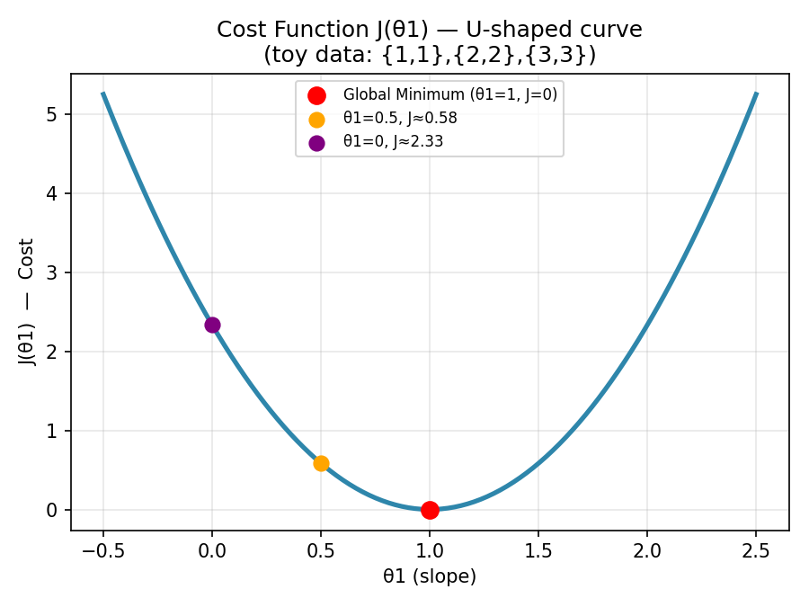

### 4. Gradient Descent

Rather than guessing θ values by trial and error, **Gradient Descent** automatically walks down the cost function curve toward the minimum, step by step:

$$\theta_j := \theta_j - \alpha \frac{\partial}{\partial \theta_j}J(\theta_0,\theta_1)$$

- **Learning Rate (α)** — controls step size
- **Convergence** — keep updating θ₀ and θ₁ until the cost stops decreasing meaningfully

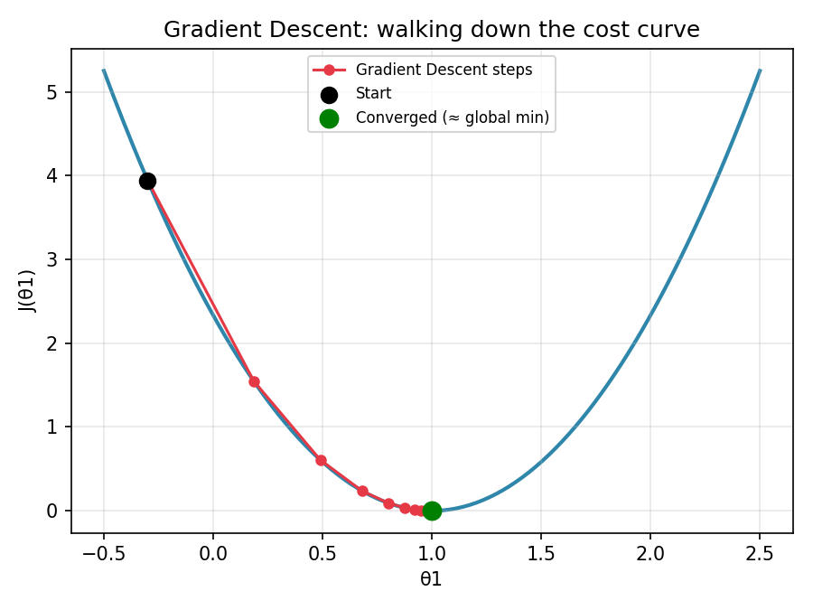

**Learning rate matters a lot:**
- Too small → painfully slow convergence
- Too large → can overshoot the minimum and fail to converge
- Just right → smooth, efficient descent

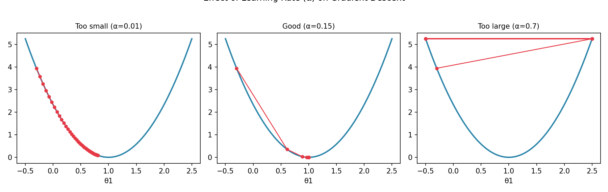

### 5. Multiple Linear Regression

With more than one input feature, the hypothesis extends to:

```
h(θ) = θ₀ + θ₁x₁ + θ₂x₂ + θ₃x₃ + ... + θₙxₙ
```

Each feature (e.g. `x₁` = Age, `x₂` = BMI, `x₃` = Smoker status) gets its own coefficient, and the model becomes a hyperplane fit through multi-dimensional space rather than a single 2D line.

### 6. Performance Metrics — R² and Adjusted R²

**R² (R-Squared)** measures how much of the variance in the target is explained by the model:

$$R^2 = 1 - \frac{\text{Sum of Squared Residuals}}{\text{Total Sum of Squares}} = 1 - \frac{\sum(y_i - \hat{y}_i)^2}{\sum(y_i - \bar{y})^2}$$

- Expressed as a decimal, read as a percentage (e.g. `0.86 → 86%`)
- Higher is generally better

**Problem with R²:** it *never decreases* when you add more features — even irrelevant ones — which can be misleading. That's where **Adjusted R²** comes in:

$$\text{Adjusted } R^2 = 1 - \left[\frac{(1-R^2)(n-1)}{n-p-1}\right]$$

- `n` → number of rows (observations)
- `p` → number of features (predictors)

Adjusted R² **penalizes unnecessary features** — if a new feature doesn't genuinely improve the model, Adjusted R² will drop even if R² rises, making it fairer for comparing models with different feature counts. (This exact phenomenon shows up for real in Project 2 below — see the [Model Performance Summary](#-model-performance-summary).)

### 7. Overfitting vs. Underfitting

| | Training Performance | Testing Performance | Bias/Variance |
|---|---|---|---|
| **Overfitting** | Great | Poor | Low bias, high variance |
| **Underfitting** | Poor | Poor | High bias, high variance |
| **Good Fit** | Good | Good | Low bias, low variance |

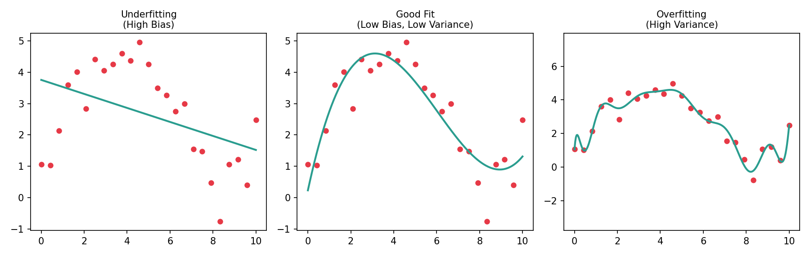

Worked illustrative example:

| Model | Training Acc. | Testing Acc. | Verdict |
|---|---|---|---|
| M1 | 92% | 64% | ❌ Overfitting |
| M2 | 92% | 90% | ✅ Good Model (low bias, low variance) |
| M3 | 68% | 64% | ❌ Underfitting |

### 8. Ridge & Lasso Regression (Regularization)

To combat overfitting, a **penalty term** is added to the cost function to discourage overly large coefficients:

$$J(\theta) = \frac{1}{2m}\sum_{i=1}^{m}\left(h_\theta(x)^{(i)} - y^{(i)}\right)^2 + \lambda(\text{slope})^2$$

- `λ` (lambda) controls how strongly large coefficients are penalized
- **Ridge Regression** — L2 penalty (squared coefficients) — shrinks coefficients but rarely to exactly zero
- **Lasso Regression** — L1 penalty (absolute coefficients) — can shrink coefficients all the way to zero, effectively performing feature selection

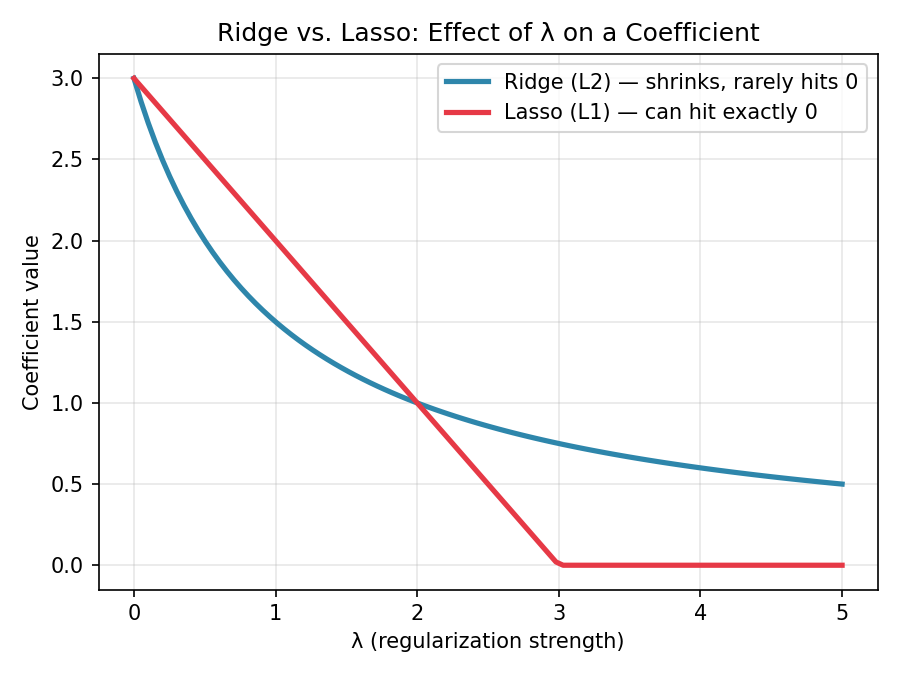

---

## 🏥 Project 1: Medical Insurance Cost Prediction

**Notebook:** `Insurance.ipynb` · **Data:** `insurance.csv` (1,338 rows × 7 columns, verified)
**Goal:** Predict individual medical insurance `charges` based on demographic and lifestyle attributes.

### Dataset Features
`age`, `sex`, `bmi`, `children`, `smoker`, `region`, `charges` (target) — confirmed: **no missing values** in any column.

### Real EDA — from the actual dataset

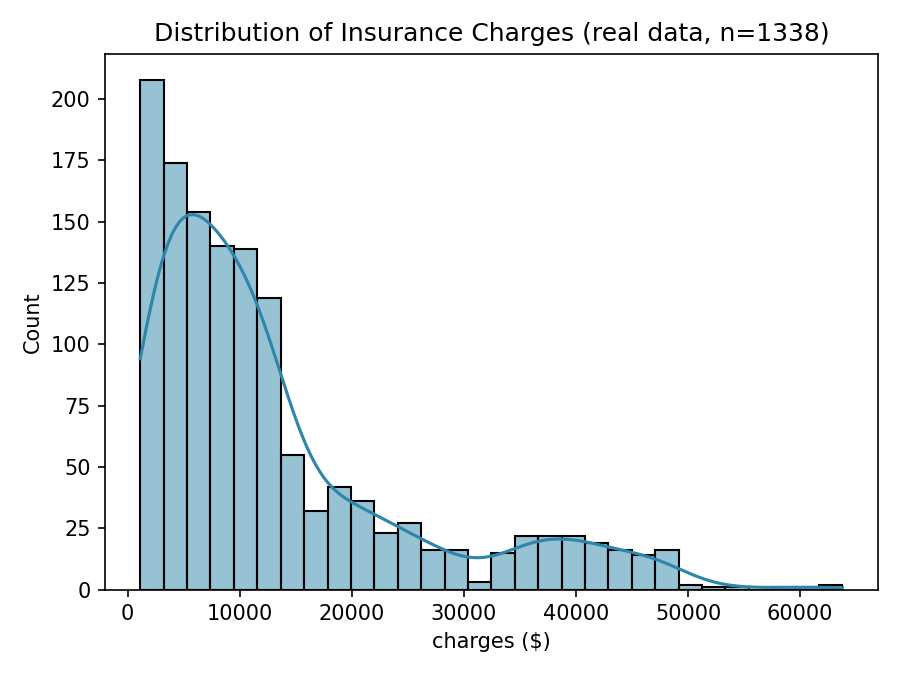

Charges are heavily **right-skewed** — most people pay relatively low premiums, but a long tail pays much more.

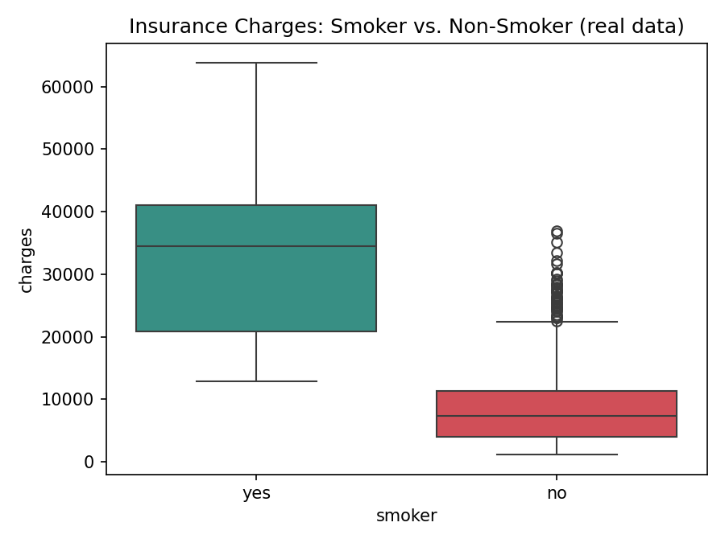

Smokers pay dramatically more than non-smokers — this shows up numerically too: `is_smoker` has the strongest Pearson correlation with `charges` at **r ≈ 0.787** (verified from the notebook output).

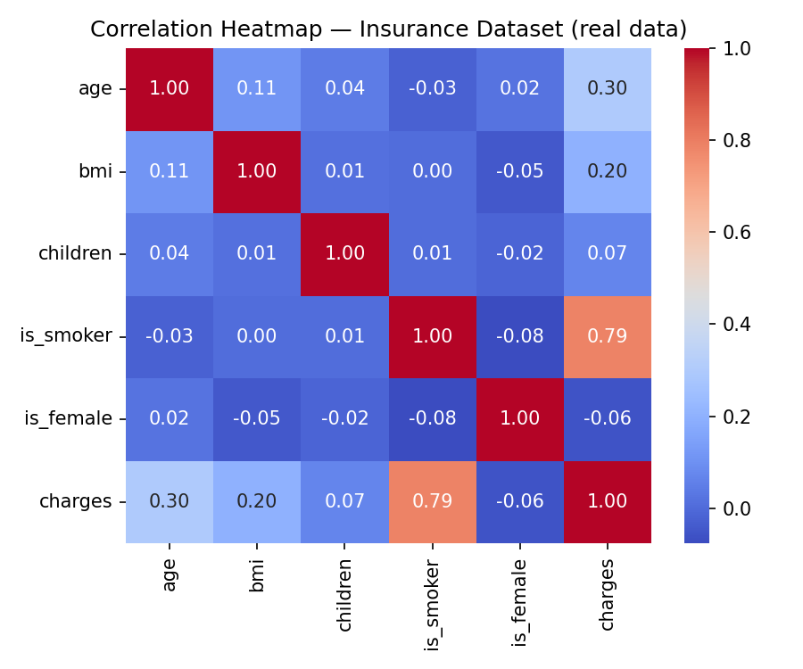

### Workflow

**1. Exploratory Data Analysis (EDA)**
- Checked shape, dtypes, summary statistics, missing values
- Distribution plots (histograms + KDE) for `age`, `bmi`, `children`, `charges`
- Count plots for categorical variables
- Boxplots for outlier detection
- Correlation heatmap across numeric features

**2. Data Cleaning & Preprocessing**
- Removed duplicate rows (1,338 → **1,337** rows, verified)
- Encoded categorical variables:
  - `sex` → `is_female` (0/1)
  - `smoker` → `is_smoker` (0/1)
  - `region` → one-hot encoded (`drop_first=True`)
- Cast all columns to `int`

**3. Feature Engineering**
- Bucketed `bmi` into clinical categories via `pd.cut`: `Underweight` (0–18.5), `Normal` (18.5–24.9), `Overweight` (24.9–29.9), `Obese` (29.9+)
- One-hot encoded `bmi_category`
- Applied `StandardScaler` to `age`, `bmi`, `children`

**4. Statistical Feature Selection**
- **Pearson Correlation** vs. `charges` — verified top features: `is_smoker` (0.787), `age` (0.298), `bmi_category_Obese` (0.200), `bmi` (0.196), `region_southeast` (0.074)
- **Chi-Square Test** (`chi2_contingency`) against binned `charges` (quartiles via `pd.qcut`), at `α = 0.05` — verified all tested categorical features had `p < 0.05` and were kept (e.g. `is_smoker`: χ² = 848.2, p ≈ 0.0; `region_southeast`: χ² = 16.0, p = 0.0011; `is_female`: χ² = 10.3, p = 0.016)

**5. Final Feature Set** (verified from notebook)
```
['age', 'is_female', 'bmi', 'children', 'is_smoker', 'charges',
 'region_southeast', 'bmi_category_Obese', 'region_northwest']
```

**6. Model Training**
- 80/20 train-test split (`random_state=42`)
- `sklearn.linear_model.LinearRegression`, fit on the training set

**7. Evaluation — Verified Result**
> **Adjusted R² = 0.7980 (≈ 80%)** on the test set (recomputed exactly from the notebook: `0.7979609952867804`) — the model explains roughly 80% of the variance in insurance charges after accounting for the number of features used.

---

## 🚗 Project 2: Ford Car Price Prediction

**Notebook:** `ford.ipynb` · **Data:** `ford.csv` (17,966 rows × 9 columns, verified)
**Goal:** Predict used-car `price` from vehicle specifications.

### Dataset Features
`model`, `year`, `price` (target), `transmission`, `mileage`, `fuelType`, `tax`, `mpg`, `engineSize` — confirmed: **no missing values**.

### Real EDA — from the actual dataset

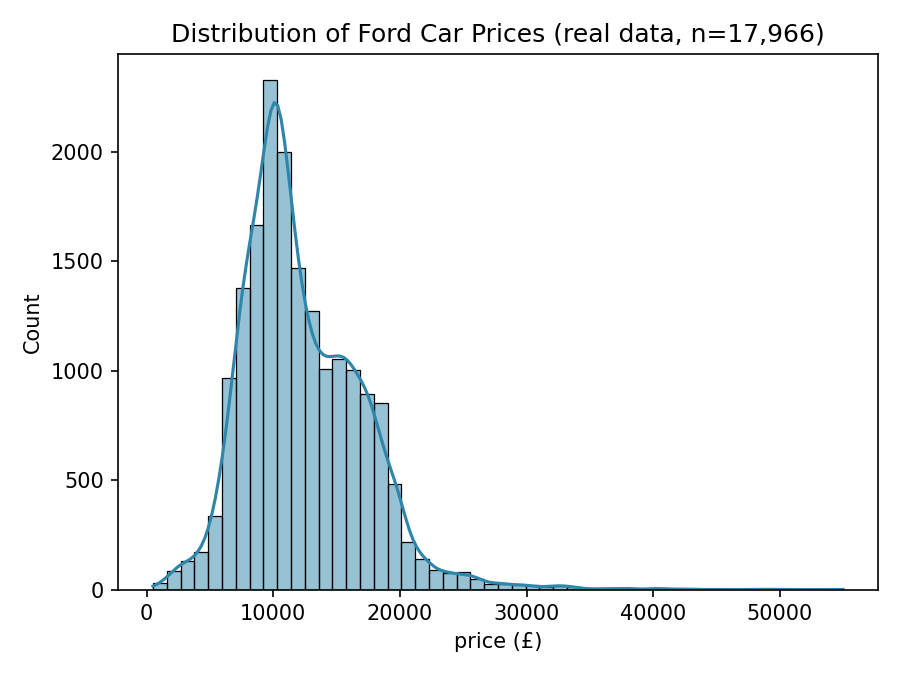

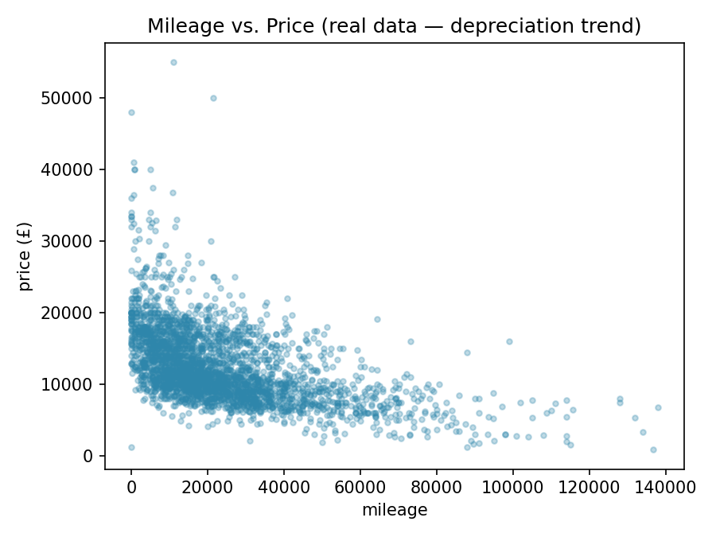

Clear depreciation trend — higher mileage generally means lower price, though there's a lot of scatter from other factors (model, year, engine size).

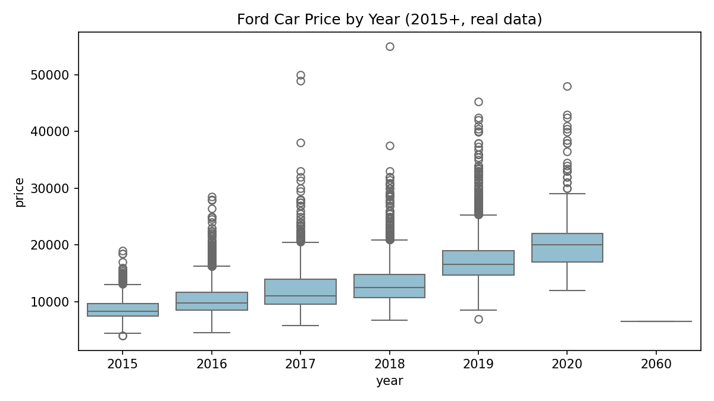

Newer cars command higher prices, as expected — with individual model lines and outliers contributing to fairly wide boxes.

### Workflow

**1. EDA**
- Shape, info, describe, missing-value check
- Distribution of `price`
- Correlation heatmap of numeric features
- Boxplots: `price` vs `year`, `engineSize`, `transmission`, `fuelType`, `model`
- Scatter: `mileage` vs `price`

**2. Encoding Strategy — Compared Two Approaches**
- **One-Hot Encoding** (`pd.get_dummies` on `model`, `transmission`, `fuelType`, `drop_first=True`)
- **Label Encoding** (`sklearn.preprocessing.LabelEncoder` on the same three columns) — an ordinal alternative

**3. Feature Scaling**
- `StandardScaler` applied to numeric columns (`year`, `mileage`, `tax`, `mpg`, `engineSize`) for the one-hot set, and to the full feature set for the label-encoded version

**4. Model Training — Two Models for Comparison**

| Model | Encoding | Split |
|---|---|---|
| `model` | One-Hot Encoded | 67/33 train-test |
| `model2` | Label Encoded | 67/33 train-test |

Both trained with `sklearn.linear_model.LinearRegression`.

**5. Results — Verified**

| Model | R² Score | Adjusted R² |
|---|---|---|
| **One-Hot Encoded** | **0.8397** (`0.8396626991294074`) | **0.8387** (`0.8387377808685319`) |
| **Label Encoded** | 0.7310 (`0.7310215557391141`) | — |

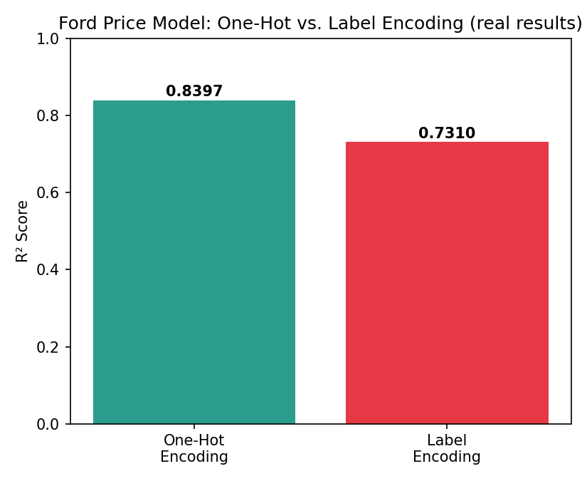

**Key takeaway (verified real result):** One-hot encoding significantly outperformed label encoding on this dataset — a genuine **~11 percentage-point gap** in R². This makes sense theoretically: label encoding imposes an artificial ordinal relationship on categorical variables like `model` and `fuelType` that have no true rank order, which misleads a linear model. One-hot encoding avoids that false assumption and better captures the categorical structure.

---

## 📊 Model Performance Summary

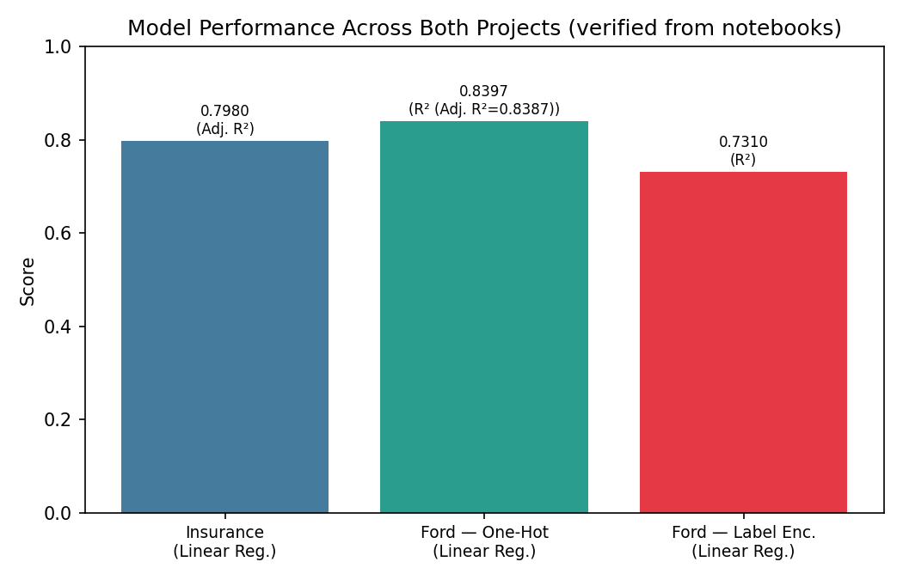

| Project | Metric | Verified Value |
|---|---|---|
| Insurance — Linear Regression | Adjusted R² | 0.7980 |
| Ford — Linear Regression (One-Hot) | R² / Adjusted R² | 0.8397 / 0.8387 |
| Ford — Linear Regression (Label Encoded) | R² | 0.7310 |

---

## 🛠 Tech Stack

- **Language:** Python 3
- **Data Handling:** Pandas, NumPy
- **Visualization:** Matplotlib, Seaborn
- **Statistics:** SciPy (`pearsonr`, `chi2_contingency`)
- **Machine Learning:** scikit-learn
  - `LinearRegression`
  - `StandardScaler`, `LabelEncoder`
  - `train_test_split`
  - `r2_score`, `mean_absolute_error`, `mean_squared_error`

---

## 🎯 Key Learnings

- Building the cost function and gradient descent by hand (rather than only calling `.fit()`) makes clear *why* Linear Regression converges to the best-fit line, not just *that* it does.
- Adjusted R² is essential when comparing models with different feature counts — it's specifically designed to catch cases where an added feature inflates raw R² without genuinely improving the model.
- Feature selection isn't purely intuition-driven — combining **Pearson correlation** (for numeric relationships) with a **Chi-square test** (for categorical independence) gave a more statistically grounded feature set for the Insurance project.
- Encoding choice matters a lot for linear models specifically: the Ford project's side-by-side comparison showed a real, measurable accuracy gap (**~11 percentage points of R²**) purely from switching Label Encoding → One-Hot Encoding.
- Overfitting/underfitting isn't just theoretical — comparing train vs. test accuracy side by side is a fast, practical diagnostic.

---

## 🚀 Future Improvements

- Apply **Ridge/Lasso Regression** (regularization) to both projects and compare against plain Linear Regression, especially for the Ford dataset which has many one-hot encoded `model` columns.
- Try non-linear models (Random Forest, Gradient Boosting/XGBoost) to benchmark against the linear baseline, since car price and insurance cost relationships are unlikely to be perfectly linear.
- Perform hyperparameter tuning (e.g. `GridSearchCV`) once regularized/non-linear models are introduced.
- Add cross-validation instead of a single train-test split for more robust performance estimates.
- Deploy the better-performing model (e.g. via Streamlit or Flask) as an interactive price/cost estimator.
