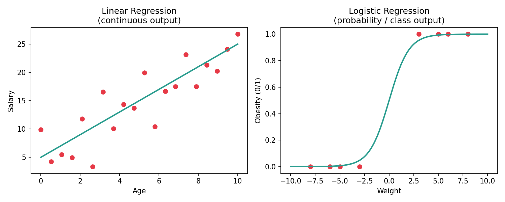
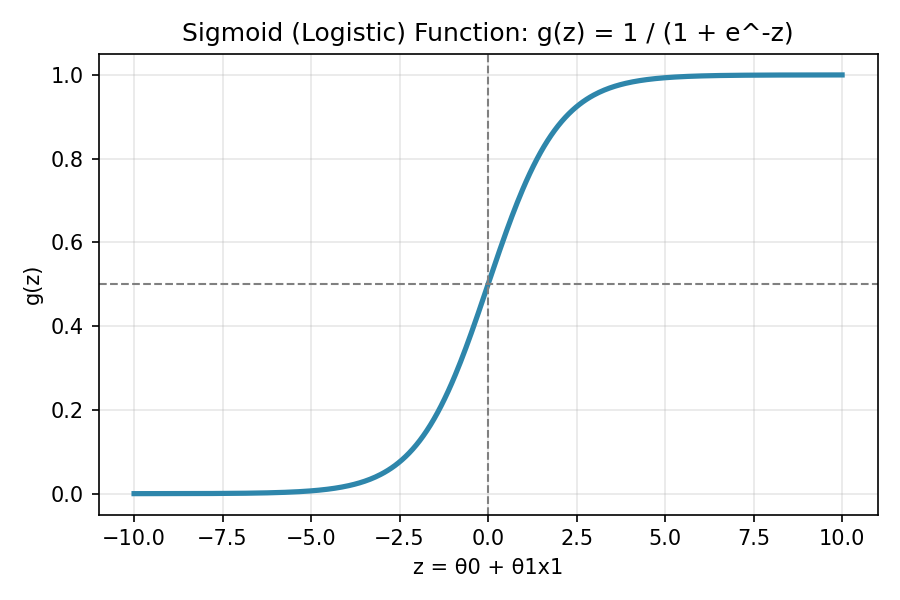
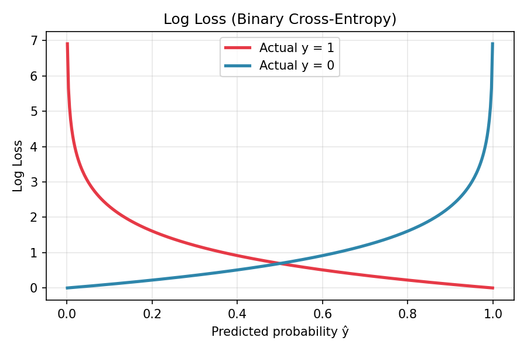
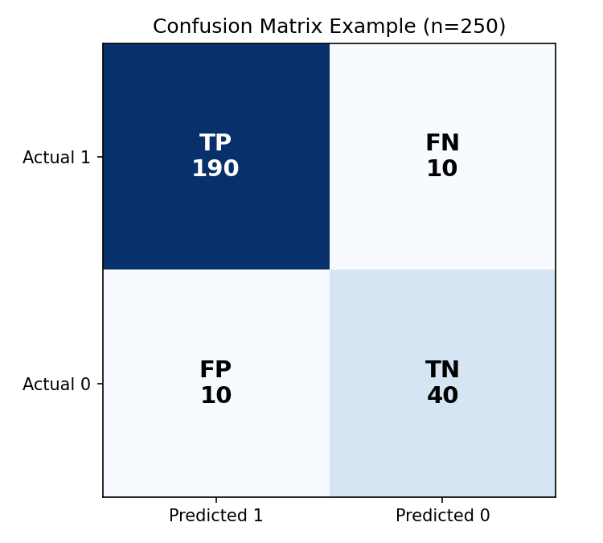
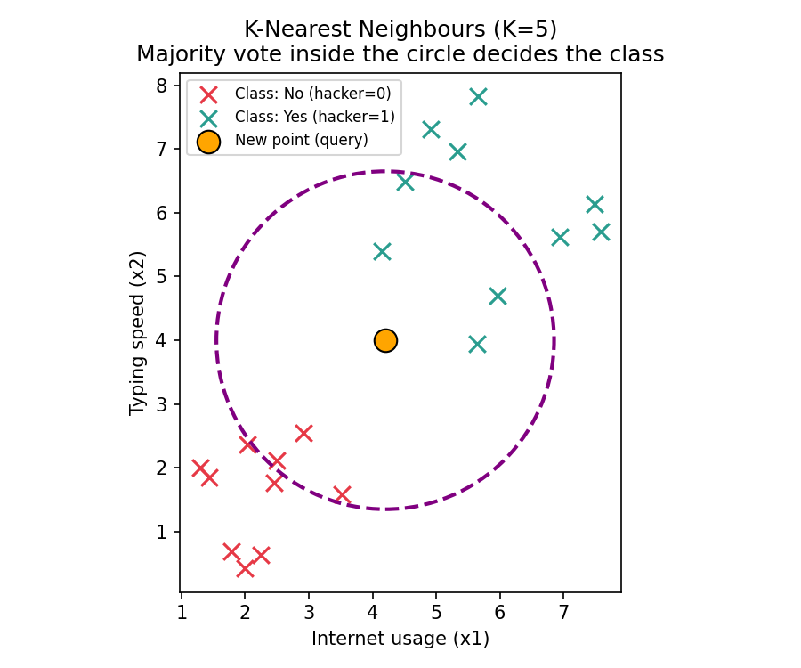
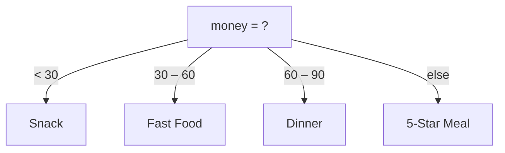
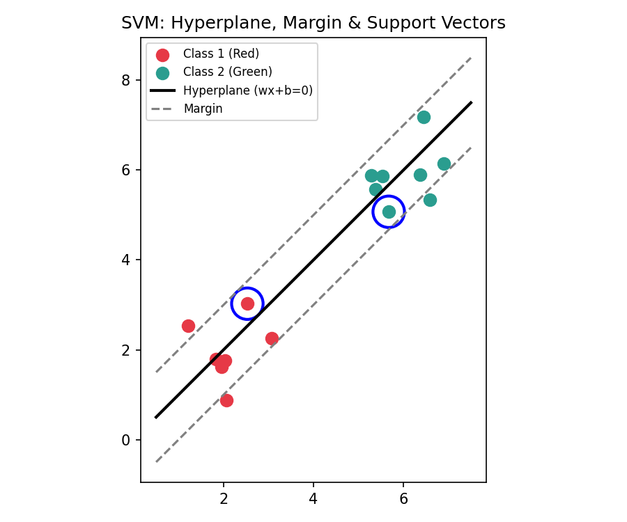
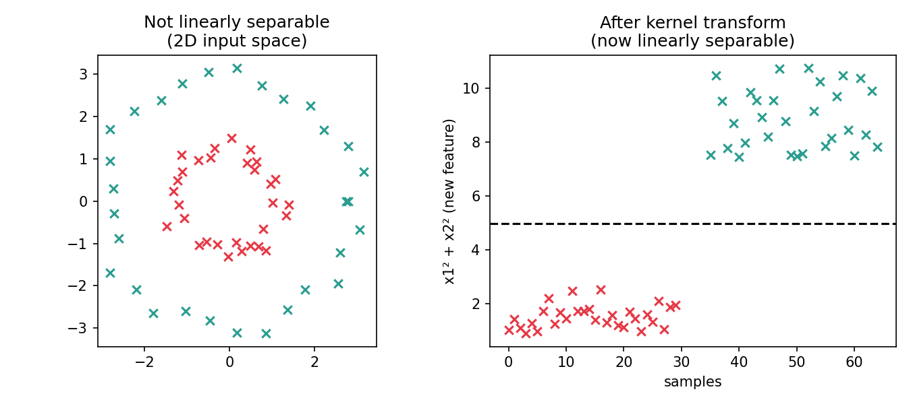

# Machine Learning Classification Models — Complete Notes

These notes cover every classification model discussed in the source notebook: **Logistic Regression, Model Evaluation Metrics, K-Nearest Neighbours (KNN), Naive Bayes, Decision Trees, and Support Vector Machines (SVM)**. All formulas and worked examples have been checked for correctness, and small mistakes from the handwritten draft have been fixed and flagged below.

---

## Table of Contents
1. [Logistic Regression](#1-logistic-regression)
2. [Log Loss (Binary Cross-Entropy)](#2-log-loss-binary-cross-entropy)
3. [Model Evaluation: Confusion Matrix & Metrics](#3-model-evaluation-confusion-matrix--metrics)
4. [K-Nearest Neighbours (KNN)](#4-k-nearest-neighbours-knn)
5. [Naive Bayes](#5-naive-bayes)
6. [Decision Trees](#6-decision-trees)
7. [Support Vector Machines (SVM)](#7-support-vector-machines-svm)
8. [Quick Reference Cheat Sheet](#8-quick-reference-cheat-sheet)

---

## 1. Logistic Regression

Logistic Regression is used for **classification** problems (predicting a category like Yes/No), not regression of a continuous number — the name is historical.

### Linear Regression vs. Logistic Regression

- **Linear Regression** fits a straight line to predict a continuous value (e.g., Salary from Age): `h(x) = θ0 + θ1·x1`
- **Linear regression breaks down for classification** because:
  1. **Outliers** can drag the best-fit line and distort predictions.
  2. The output of a straight line is unbounded — it can go below 0 or above 1, but a probability must stay between 0 and 1.
- **Fix:** "squash" the straight line into an **S-shaped curve** using the **Sigmoid function**.

### The Sigmoid Function

$$g(z) = \frac{1}{1 + e^{-z}}$$

Substituting `z = θ0 + θ1x1` gives the logistic regression hypothesis:

$$h_\theta(x) = g(\theta_0 + \theta_1 x_1) = \frac{1}{1 + e^{-(\theta_0 + \theta_1 x_1)}}$$

- **e** = Euler's number, a mathematical constant ≈ **2.71828**
- The exponential term is what gives the curve its smooth "S" shape (instead of a sharp corner).

### Linear vs. Logistic Regression — what θ0, θ1 do

| | Linear Regression | Logistic Regression |
|---|---|---|
| θ0, θ1 are used to... | create the **best-fit line** | create the best **squashed (S-shaped) curve** |
| Error is measured by... | Cost function (e.g., Mean Squared Error) | **Log Loss** function |

---

## 2. Log Loss (Binary Cross-Entropy)

Log Loss (also called **Binary Cross-Entropy**) measures how wrong a probability prediction is, for a true label of 0 or 1.

$$\text{Log Loss} = -\frac{1}{m}\sum_{i=1}^{m}\Big[y^{(i)}\log(\hat{y}^{(i)}) + (1-y^{(i)})\log(1-\hat{y}^{(i)})\Big]$$

Where:
- **m** = number of samples
- **y⁽ⁱ⁾** = actual label (0 or 1)
- **ŷ⁽ⁱ⁾** = predicted probability (between 0 and 1)

### Intuition (verified with real numbers)

| Actual y | Predicted ŷ | Result |
|---|---|---|
| 1 | 0.99 | **Very low loss** — the model was confident and correct |
| 1 | 0.01 | **Very high loss** — the model was confident and *wrong*, so it's heavily **penalized** |
| 1 | 0.54 | Log Loss ≈ **0.616** → verified: `-log(0.54) = 0.616` ✅ |

The curve above shows why: as the predicted probability moves further from the true label, the penalty grows sharply (not linearly) — this is what pushes the model's parameters (θ0, θ1) toward their optimal values at the **global minimum** of the loss curve during training.

---

## 3. Model Evaluation: Confusion Matrix & Metrics

### The Confusion Matrix

For a binary classifier, results are organized as:

|              | Predicted: 1 | Predicted: 0 |
|--------------|:---:|:---:|
| **Actual: 1** | TP (True Positive) | FN (False Negative) |
| **Actual: 0** | FP (False Positive) | TN (True Negative) |

> **Correction from the original notes:** the bottom-right cell should be **TN (True Negative)**, not FP — a confusion matrix must have TP, FN, FP, and TN as its four distinct cells.

**Type I Error** = False Positive (FP) — predicting positive when it's actually negative.
**Type II Error** = False Negative (FN) — predicting negative when it's actually positive.

### Worked Example (n = 250)

TP = 190, FN = 10, FP = 10, TN = 40

### 1. Accuracy — % of all predictions that were correct

$$\text{Accuracy} = \frac{TP + TN}{TP + TN + FP + FN} = \frac{190 + 40}{250} = 0.92 = 92\%$$

> **Correction:** the original formula was written as `(TP+FP)/(TP+FP+FN+FP)`, which is a typo — accuracy correctly uses **TP + TN** in the numerator and **all four cells** in the denominator (the calculation itself, using 40, was already correct).

### 2. Precision — of everything predicted positive, how much was actually positive?

$$\text{Precision} = \frac{TP}{TP + FP} = \frac{190}{200} = 0.95 = 95\%$$

**Use when False Positives are costly** — e.g. spam detection (you don't want to wrongly flag a real email as spam).

### 3. Recall (Sensitivity) — of everything actually positive, how much did we catch?

$$\text{Recall} = \frac{TP}{TP + FN} = \frac{190}{200} = 0.95 = 95\%$$

**Use when False Negatives are costly** — e.g. disease detection (you don't want to miss an actual sick patient).

### 4. F1 Score — harmonic mean of Precision and Recall

$$F_1 = \frac{2 \times \text{Precision} \times \text{Recall}}{\text{Precision} + \text{Recall}}$$

**Use when you want a balance between Precision and Recall**, especially with imbalanced classes.

---

## 4. K-Nearest Neighbours (KNN)

KNN classifies a new data point by looking at the **K closest existing points** to it and taking a **majority vote** of their classes.

### How it works
1. **Define K** (a hyperparameter) — e.g., K = 5 means "look at the 5 nearest neighbours."
2. **Calculate the distance** from the new point to every existing point (typically **Euclidean distance**).
3. **Sort** all distances, smallest to largest, and take the top K.
4. **Majority vote**: whichever class appears most often among those K neighbours becomes the prediction.

> **Important rule: K should be an odd number** (for binary classification) to avoid a tied vote.

- Beyond classification, KNN can also be used for **regression**, by taking the **mean of the K nearest neighbours' values** instead of a majority vote.
- KNN works in any number of dimensions (**n-dimensional** feature spaces), not just 2D.

### Choosing K (via experimentation / cross-validation)
The right K is usually found empirically by testing different values on a validation/test split, e.g.:

| K | Example Accuracy |
|---|---|
| 1 | 60% |
| 3 | 89% |
| 5 | 86% |
| 25 | 92% ✅ (best in this experiment) |

This process of testing different hyperparameter values against held-out data is a form of **cross-validation**.

---

## 5. Naive Bayes

Naive Bayes is a **probabilistic classifier** based on **Bayes' Theorem**, with a "naive" assumption that all input features are conditionally independent given the class.

### Independent vs. Dependent Events

**Independent events** (one event doesn't affect the other) — e.g., flipping a coin, rolling a die:
$$P(\text{Head}) = \tfrac{1}{2}, \quad P(\text{Tail}) = \tfrac{1}{2}, \quad P(6) = \tfrac{1}{6}$$
$$P(A \text{ and } B) = P(A) \times P(B)$$

**Dependent events** (one event changes the probability of the other) — e.g., drawing 2 cards from a 52-card deck without replacement:
$$P(\text{Red}_1) = \frac{26}{52} = \frac{1}{2}, \quad P(\text{Red}_2 \mid \text{Red}_1 \text{ drawn}) = \frac{25}{51}$$
This second probability is called a **conditional probability**, and:
$$P(A \text{ and } B) = P(A) \times P(B \mid A)$$

### Deriving Bayes' Theorem

Since `P(A and B) = P(B and A)`:
$$P(A) \times P(B \mid A) = P(B) \times P(A \mid B)$$

Rearranging gives **Bayes' Theorem**:
$$P(A \mid B) = \frac{P(A) \times P(B \mid A)}{P(B)}$$

### Applying Bayes' Theorem to Classification

For features `x1, x2, x3, x4` (independent) predicting an output `y` (0 = No, 1 = Yes):

$$P(y \mid x_1,x_2,x_3,x_4) = \frac{P(y) \times P(x_1\mid y) \times P(x_2\mid y) \times P(x_3\mid y) \times P(x_4\mid y)}{P(x_1)\times P(x_2)\times P(x_3)\times P(x_4)}$$

The classifier computes this for **each class** (e.g., `P(Yes | features)` and `P(No | features)`) and predicts whichever is larger. Since the denominator is the same for every class, in practice it's often skipped, and only the numerators are compared.

---

## 6. Decision Trees

A Decision Tree splits data into branches based on feature values, ending in leaves that hold a predicted class.

### Structure
- **Root** — the top-most decision node
- **Branches** — the paths leading from one decision to the next
- **Leaves** — the final predicted outcomes

### Building a Decision Tree — Algorithm
1. Start with the data.
2. Choose the **best feature** to split on.
3. Make branches based on that feature's values.
4. Repeat the process for each branch.
5. Stop when:
   - All data in a branch is **pure** (all one class), **or**
   - The **maximum depth** is reached.

The "best feature" to split on at each step is chosen using **Entropy** and **Information Gain**.

### Entropy — how "impure"/mixed a set is

$$\text{Entropy}(S) = -p_+\log_2(p_+) - p_-\log_2(p_-)$$

Worked example — the classic "Play Tennis" dataset (14 rows: 9 Yes, 5 No):

$$\text{Entropy(Play)} = -\frac{9}{14}\log_2\!\left(\frac{9}{14}\right) - \frac{5}{14}\log_2\!\left(\frac{5}{14}\right) = 0.940 \; ✅ \text{ (verified)}$$

Splitting by the **Outlook** feature:
- Sunny (2 Yes, 3 No): Entropy = `-2/5·log2(2/5) - 3/5·log2(3/5)` = **0.971** ✅
- Overcast (all Yes, pure): Entropy = **0** ✅
- Rain (3 Yes, 2 No): Entropy = **0.971** ✅

### Information Gain — how much a split reduces entropy

$$IG(S,\text{Outlook}) = \text{Entropy}(S) - \sum_{v \in \text{values}} \frac{|S_v|}{|S|}\text{Entropy}(S_v)$$

$$IG = 0.940 - \left[\frac{5}{14}(0.971) + \frac{4}{14}(0) + \frac{5}{14}(0.971)\right] = 0.940 - 0.694 = 0.246 \; ✅ \text{ (verified)}$$

Comparing Information Gain across all features for this dataset:

| Feature | Information Gain |
|---|---|
| **Outlook** | **0.246** ← highest, chosen as the root split |
| Humidity | ~0.15–0.19 |
| Wind | ~0.048 |
| Temperature | ~0.029 |

The feature with the **highest Information Gain** is chosen at each step — here, **Outlook** becomes the root node because it splits the data most effectively.

---

## 7. Support Vector Machines (SVM)

SVM finds the **best possible boundary line (or plane)** that separates two classes, maximizing the distance to the nearest points of each class.

### Key terms
- **Hyperplane** — the line/plane that separates the two categories.
  - In **2D**, it's called a **hyperline**.
  - In **3D** (or higher), it's called a **hyperplane**.
- **Margin** — the space between the hyperplane and the nearest data point of each class.
- **Support Vectors** — the closest data points to the hyperplane; these are the points that "support" (define) where the boundary line sits.

### The Decision Rule

$$w \cdot x + b = 0 \quad \text{(the hyperplane itself)}$$

Where:
- **x** = the point you want to classify
- **w** = weight (slope of the boundary)
- **b** = bias

Classification rule:
- If `w·x + b > 0` → **Class 1** (e.g., Red)
- If `w·x + b < 0` → **Class 2** (e.g., Green)

SVM tries to choose `w` and `b` so the **margin is as wide as possible**, which tends to generalize better to new data.

### The Kernel Trick — for data that isn't linearly separable

When classes are arranged so that **no straight line** can separate them (e.g., one class forming a ring around the other), SVM uses **kernels** to project the data into a higher-dimensional space where a straight hyperplane *can* separate them.

For example, points arranged in concentric circles in 2D become linearly separable once transformed into a feature like `x1² + x2²` — a kernel function does this transformation (implicitly, without ever explicitly computing the new coordinates, thanks to the "kernel trick").

---

## 8. Quick Reference Cheat Sheet

| Model | Type | Core Idea |
|---|---|---|
| **Logistic Regression** | Classification | Squashes a linear equation through a sigmoid to output a probability (0–1) |
| **KNN** | Classification / Regression | Predicts based on the majority class (or average) of the K closest points |
| **Naive Bayes** | Classification | Uses Bayes' Theorem, assuming features are independent given the class |
| **Decision Tree** | Classification / Regression | Splits data repeatedly on the feature with highest Information Gain |
| **SVM** | Classification | Finds the hyperplane with the maximum margin between classes; uses kernels for non-linear data |

**Evaluation metrics** (for any classifier): **Accuracy**, **Precision**, **Recall**, **F1 Score** — computed from the **Confusion Matrix** (TP, TN, FP, FN).

---

### Note on the accompanying notebook
The referenced `all_models.ipynb` notebook applies exactly these five models (Logistic Regression, KNN, Naive Bayes, Decision Tree, SVM) to the Titanic survival dataset — preprocessing the data (encoding `sex`/`embarked`, filling missing `age`), splitting into train/test sets, then fitting and evaluating each model with `accuracy_score`, `confusion_matrix`, and `classification_report`, followed by cross-validation. This is the practical, hands-on counterpart to the theory in this document.

---

## ⭐ Support This Repository

If you found this notebook useful, consider:

⭐ **Starring this repository** to support the project  
🍴 **Forking it** if you want to experiment with the code  
💬 **Sharing your feedback** or suggestions  
🔗 **Following me on LinkedIn** for more Machine Learning, AI, Data Science, and Python content

👉 **LinkedIn:** [Hamza Anjum](https://www.linkedin.com/in/hamza-anjum-459bba320/)

If you're also learning Machine Learning, feel free to explore the other notebooks in this repository.

**Keep learning. Keep building. 🚀**