# Machine Learning Notes — Part 4
### Model Tuning, Cross Validation, Hyperparameter Tuning, Ensemble Learning & Unsupervised Learning

> Source: Handwritten lecture notes + accompanying Jupyter notebooks (`GridSearchCV.ipynb`, `EnsembleLearning.ipynb`, `Clustring.ipynb`, `PCADimensions.ipynb`).
> Video reference: [Full lecture (YouTube)](https://www.youtube.com/watch?v=UFAHXZW2hU8&list=PLaldQ9PzZd9qT0KsKJ7yCq70iFFP3MFJ5&index=4)

---

## Table of Contents
1. [Model Tuning — Why It Matters](#1-model-tuning--why-it-matters)
2. [Cross Validation](#2-cross-validation)
3. [Hyperparameter Tuning](#3-hyperparameter-tuning)
4. [Grid Search CV](#4-grid-search-cv)
5. [Random Search CV](#5-random-search-cv)
6. [Ensemble Learning — Overview](#6-ensemble-learning--overview)
7. [Stacking](#7-stacking)
8. [Bagging (Bootstrap Aggregation)](#8-bagging-bootstrap-aggregation)
9. [Random Forest](#9-random-forest)
10. [Boosting](#10-boosting)
11. [AdaBoost, Gradient Boosting & XGBoost](#11-adaboost-gradient-boosting--xgboost)
12. [Bagging vs Boosting (Bias-Variance View)](#12-bagging-vs-boosting-bias-variance-view)
13. [Unsupervised Learning — Overview](#13-unsupervised-learning--overview)
14. [Clustering & K-Means](#14-clustering--k-means)
15. [DBSCAN](#15-dbscan)
16. [Curse of Dimensionality](#16-curse-of-dimensionality)
17. [Dimensionality Reduction & PCA](#17-dimensionality-reduction--pca)
18. [Code Reference (from notebooks)](#18-code-reference-from-notebooks)

---

## 1. Model Tuning — Why It Matters

The first version of any machine learning model you build is **never** the best version. That's exactly the problem **Model Tuning** solves.

When a model is trained, it has certain settings called **hyperparameters** — values that are *not learned from data* but are set by us before training. Examples:
- How deep a Decision Tree should grow
- How many neighbors (`k`) to use in KNN
- What learning rate to use in boosting algorithms

If we pick hyperparameters randomly, the model can:
- **Underfit** — too simple, misses patterns
- **Overfit** — too complex, memorizes training data
- **Perform poorly** on new/unseen data

**Goal of Model Tuning (a.k.a. Hyperparameter Tuning):**
1. Find the best combination of hyperparameters
2. Make the model generalize well to new, unseen data — not just score well on training data

Before we can tune anything properly, we first need a reliable way to *evaluate* a model — that's what **Cross Validation** gives us.

---

## 2. Cross Validation

### The Problem with a Simple Train/Test Split
Normally we split data as **80% training / 20% testing**. But this has a downside: our evaluation score depends heavily on *which* 20% happened to land in the test set — a "lucky" or "unlucky" split can make the model look better or worse than it really is.

### K-Fold Cross Validation
Instead of a single split, **K-Fold Cross Validation**:
1. Divides the full dataset into **K equal parts (folds)**.
2. Each fold takes a turn being the **testing data**, while the remaining `K-1` folds become the **training data**.
3. This is repeated K times, and each time we record an accuracy score.
4. The **final performance = average of all K accuracy scores.**

Example with **K = 5**:

| Fold used as Test | Accuracy |
|---|---|
| Fold 1 | 81% |
| Fold 2 | 82% |
| Fold 3 | 86% |
| Fold 4 | 85% |
| **Average** | **~83.5%** |

This average accuracy is a much more reliable estimate of how the model will perform on truly unseen data, because every data point gets a chance to be in the test set exactly once.

**Quick intuition example from the notes:** if you pick different values of `k` for a KNN-style vote (e.g. k=3 vs k=5) on the same neighborhood of points, the "yes/no" majority decision can flip depending on `k` — this is why validating across multiple splits (rather than one fixed split) gives a trustworthy signal.

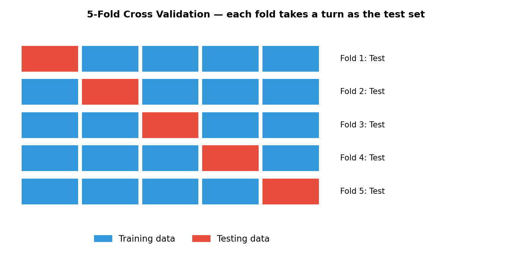
*Each fold takes a turn as the test set while the rest form the training set; the final score is the average across all folds.*

---

## 3. Hyperparameter Tuning

Different algorithms have different hyperparameters to tune:

| Algorithm | Key Hyperparameter(s) |
|---|---|
| Ridge / Lasso Regression | `alpha` (α) — the learning/regularization rate |
| KNN | `n_neighbors` — e.g. `[3, 5, 7, 9]` |
| Decision Tree | `max_depth`, `sample_split`, `max_features` |
| SVM | `kernel` (e.g. rbf, linear) |
| Random Forest | number of trees, tree depth, etc. |
| DBSCAN | `eps` (epsilon distance), `min_samples` |

### Three Ways to Search for the Best Hyperparameters
1. **Manual Search** — try values by hand, one at a time (slow, unreliable, not scalable).
2. **Grid Search CV** — exhaustively try *every* combination of given hyperparameter values, combined with cross validation.
3. **Randomized Search CV** — randomly sample a fixed number of combinations instead of trying all of them (much faster on large search spaces).

---

## 4. Grid Search CV

**Grid Search CV** systematically tries **every possible combination** of the hyperparameter values you provide, and for each combination it runs **Cross Validation** to compute an average accuracy. The combination with the best average accuracy is selected as the "winner."

### Worked Example: Tuning KNN
Suppose we want to tune three hyperparameters:
- `N` (n_neighbors) = `[3, 5, 7, 9, 11, 13]`
- `weights` = `["uniform", "distance"]`
- `metric` = `["manhattan", "euclidean"]`

Grid Search builds **every combination** of these three lists and evaluates each one with cross validation (e.g. `cv = 5`):

| N | weight | metric | Accuracy |
|---|---|---|---|
| 3 | uniform | manhattan | Acc = ? |
| 3 | distance | manhattan | Acc = ? |
| 3 | uniform | euclidean | Acc = ? |
| 3 | distance | euclidean | Acc = ? |
| ... | ... | ... | ... |

Every row here is evaluated with 5-fold CV, and an **average accuracy** is computed for each combination. Whichever row scores highest is the best hyperparameter set.

**Total combinations** = (number of N values) × (number of weight values) × (number of metric values).
This grows fast — this is the main downside of Grid Search: it is **exhaustive and computationally expensive**, especially with many hyperparameters or many possible values.

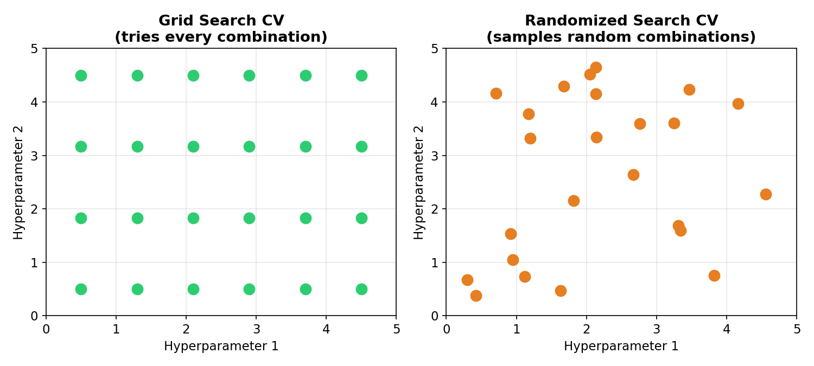
*Grid Search tests every point on a fixed grid; Random Search samples a fixed number of random points from the same space — much cheaper on large search spaces.*

---

## 5. Random Search CV

When the number of hyperparameter combinations becomes huge (e.g. XGBoost with many parameters), Grid Search becomes too slow because it must try *every single combination*.

**Randomized Search CV** solves this by **randomly sampling a fixed number (`n_iter`) of combinations** from the search space, rather than testing all of them.

### Example
For KNN:
- `N` has 6 possible values
- `weight` has 2 possible values
- `metric` has 2 possible values
- Total possible combinations = 6 × 2 × 2 = **24**

For XGBoost:
- `learning_rate` has 10 values
- `n_estimators` has 20 values
- `max_depth` has 10 values
- Total possible combinations = 10 × 20 × 10 = **2000**

Instead of testing all 2000 combinations (extremely slow), Randomized Search will pick a random subset (e.g. 30 random combinations) and evaluate only those with cross validation — dramatically cutting compute time while still usually finding a very good hyperparameter set.

**Grid Search vs Random Search — when to use which:**
- Small search space → **Grid Search** (guarantees the best combination within the grid)
- Large/high-dimensional search space → **Random Search** (much faster, "good enough" results)

---

## 6. Ensemble Learning — Overview

> *"We hear the crowd"* — the core idea of ensemble learning is that combining the opinions/predictions of **multiple models** usually gives a better, more robust prediction than relying on a single model.

Instead of training one model (`Train → Test`), we train **multiple different models** (M1, M2, M3, M4...) on the same problem, and then combine their individual predictions into one final answer.

### Worked Example
Given four base models — Logistic Regression (M1), SVM (M2), Naive Bayes (M3), KNN (M4) — each trained on the same data (features: typing speed, internet usage → target: hacker or not):

| Model | Prediction for query (typing speed=56, internet usage=28) |
|---|---|
| M1 (LR) | 1 |
| M2 (SVM) | 1 |
| M3 (NB) | 1 |
| M4 (KNN) | 0 |

**Voting result:** 3 models say "Yes" (1), 1 model says "No" (0) → Final prediction = **Yes (majority vote)**.

For **classification**, ensemble models typically combine predictions via **majority voting**.
For **regression**, instead of voting, ensemble models combine predictions by taking the **mean (average)** of all model outputs.

### Types of Ensemble Learning
There are three major categories:

1. **Bagging** (Bootstrap Aggregation) → e.g. Random Forest
2. **Boosting** → e.g. AdaBoost, Gradient Boosting, XGBoost
3. **Stacking**

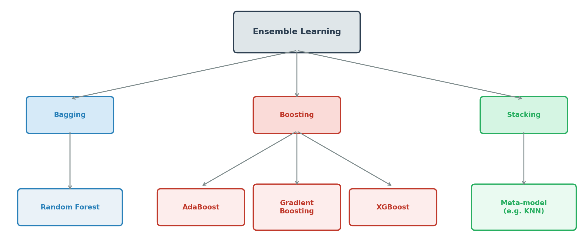
*The three families of ensemble learning and their most common algorithms.*

---

## 7. Stacking

**Stacking (Stacked Generalization)** trains several different **base models** (e.g. SVM, Decision Tree, Logistic Regression) on the same data, then feeds *their predictions* as input features into a final **meta-model** (e.g. KNN), which learns how to best combine the base models' outputs into a final prediction.

### How it Works
1. The full dataset is split into **Training** and **Testing** sets.
2. The training set is further divided into chunks — e.g. with 1000 training points split into 5 folds of 200 points each.
3. **Base models** (SVM, LR, DT) are trained on the training folds.
4. Each base model produces predictions (`SVM_Pred`, `LR_Pred`, `DT_Pred`) for the held-out fold.
5. These prediction columns become the **new input features** for the **meta-model** (KNN in this example).
6. The meta-model is trained on these "prediction features" to learn the best way to combine the base learners.
7. At prediction time, the same pipeline runs: base models predict → their predictions become features → meta-model makes the final call.

### Numeric Walkthrough from the Notes
- 1000 training points → 5 folds of 200 each; 200 points held out for testing.
- Base models (SVM, LR, DT) generate predictions per fold, forming a table of `SVM_Pred | LR_Pred | DT_Pred` → fed into meta-model (KNN) → 200 predictions per fold.
- The meta-model is trained on the combined 200+200 predictions across folds (repeating across all folds) to build up a full training set of meta-features for ~1000 predictions total.

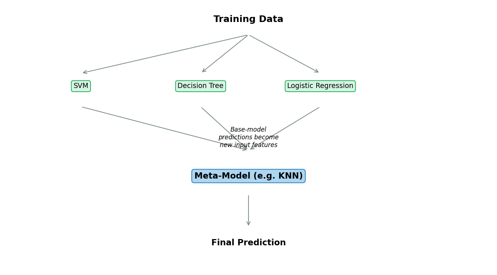
*Base models are trained on the data; their predictions become the input features for a meta-model, which produces the final prediction.*

---

## 8. Bagging (Bootstrap Aggregation)

**Bagging** stands for **Bootstrap Aggregating**. The idea:

1. From the original dataset (e.g. 2000 data points), create multiple **random subsets** via **bootstrap sampling** (random sampling **with replacement**) — e.g. D1, D2, D3, D4, each with 1000 points.
2. Train an **identical type of model** (e.g. SVM, or in general, weak learners like small decision trees) separately on each subset → M1, M2, M3, M4.
3. Each model produces its own prediction.
4. Combine all predictions via **majority voting** (classification) or **averaging** (regression) to get the final output.

Because each model only sees a random subset of the data, individual models tend to overfit *differently* — and combining them cancels out a lot of that individual overfitting, producing a more stable, generalized final prediction.

### Worked Example (Weather Data → "Play?")
Using a dataset with 1000 data points and columns `Outlook, Temperature, Humidity, Wind → Play (Yes/No)`:
- Take a **random forest classifier** made of, say, **100 Decision Trees**.
- Each tree is trained on a random bootstrap sample of ~600 data points (out of the full 1000).
- **Tree 1** might pick `[Temperature, Wind]` as its root/important features, splitting first on **Wind** (weak/strong), then branching further by Outlook.
- **Tree 2** (trained on a *different* random 600-point sample) might instead pick `[Outlook, Temperature]`, splitting first on **Outlook** (rain / sunny / overcast).
- Because each tree sees different data *and* can consider different feature subsets, the trees end up different from each other — this diversity is what makes the ensemble powerful.
- For a new query, **every tree votes**, and the majority vote becomes the final prediction ("Play" or "No Play").

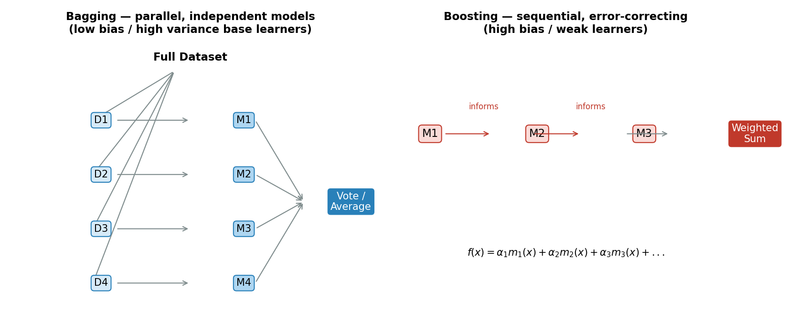
*Left half: Bagging trains the same model type on random bootstrap subsets in parallel, then combines predictions by vote/average.**

---

## 9. Random Forest

**Random Forest** is the most well-known bagging-based algorithm. It is essentially:
> **Bagging + Decision Trees**, where each tree also considers only a random subset of features at each split (not just a random subset of rows).

Key properties:
- Built from many Decision Trees (e.g. 100 trees), each trained on a random subset of the data.
- Each tree can end up with a different structure and different "important" splitting features because of the randomness in both **rows sampled** and **features considered**.
- Final prediction = majority vote (classification) or mean (regression) across all trees.
- Reduces overfitting compared to a single deep decision tree (single decision trees have **high variance**; averaging many of them reduces that variance).

---

## 10. Boosting

Unlike Bagging (where models are trained **independently and in parallel**), **Boosting** trains models **sequentially**, where **each new model tries to correct the mistakes of the previous model**.

### How it Works
1. Train model **M1** on the full dataset (e.g. 2000 points).
2. Look at where M1 made errors. Increase the "weight"/importance of the misclassified points.
3. Train model **M2**, which is *informed* by M1's mistakes — it focuses more on the points M1 got wrong.
4. Train model **M3**, informed by M2's mistakes, and so on.
5. Each individual model in the sequence is a **weak learner** — only slightly better than random guessing on its own.
6. Combine all the weak learners into one **strong learner** using a **weighted sum**:

$$
f(x) = \alpha_1 \cdot m_1(x) + \alpha_2 \cdot m_2(x) + \alpha_3 \cdot m_3(x) + \dots + \alpha_n \cdot m_n(x)
$$

Where `α₁, α₂, ... αₙ` are weights that reflect how much "say" each weak learner gets in the final combined prediction (better-performing learners typically get a higher weight).

### Popular Boosting Algorithms
1. **AdaBoost** (Adaptive Boosting)
2. **Gradient Boosting**
3. **XGBoost** (Extreme Gradient Boosting)

*(See the right half of the Bagging vs Boosting diagram above — Boosting trains models sequentially, each one correcting the errors of the last.)*

---

## 11. AdaBoost, Gradient Boosting & XGBoost

While the core "sequential, error-correcting" idea is shared by all boosting algorithms, they differ in **how** they correct errors:

- **AdaBoost (Adaptive Boosting):** Increases the *weight* of misclassified data points after each round, so the next weak learner pays more attention to the hard-to-classify points. Final prediction is a weighted vote of all weak learners.
- **Gradient Boosting:** Instead of reweighting data points, each new model is trained to predict the **residual errors** (the gradient of the loss function) left by the previous models — essentially learning to fix what's still wrong, step by step.
- **XGBoost (Extreme Gradient Boosting):** An optimized, regularized, and highly efficient implementation of gradient boosting — faster, handles missing data well, and includes built-in regularization to reduce overfitting. It's one of the most popular boosting libraries in practice (and has a much larger hyperparameter search space, as seen in the Random Search example: `learning_rate`, `n_estimators`, `max_depth`).

---

## 12. Bagging vs Boosting (Bias-Variance View)

This is one of the most important conceptual distinctions in ensemble learning:

| | Bagging | Boosting |
|---|---|---|
| Training style | Parallel, independent models | Sequential, each model corrects the previous one |
| Base learner tendency | **Low bias, high variance** (e.g. deep, complex decision trees) → prone to **overfitting** | **High bias, high variance** initially (weak learners, e.g. shallow trees/stumps) → prone to **underfitting** |
| What the ensemble fixes | Reduces **variance** by averaging many overfitting models → result: low bias, low variance → **generalized** | Reduces **bias** by sequentially focusing on errors → result: low bias, low variance → **generalized** |
| Example algorithms | Random Forest | AdaBoost, Gradient Boosting, XGBoost |

**In short:**
- **Bagging** starts with models that **overfit** (low bias/high variance) and combines them to cancel out the variance.
- **Boosting** starts with weak models that **underfit** (high bias/high variance) and sequentially combines them to reduce both the bias and variance, ending up "generalized" either way.

---

## 13. Unsupervised Learning — Overview

### What is Unsupervised Learning?
Unsupervised Learning is a type of Machine Learning where:
- The data does **NOT** have labels — there is no "right answer" provided.
- The model must find **patterns, structure, and relationships** in the data entirely on its own.

### Goal of Unsupervised Learning
- Find **hidden structure** in the data:
  - Group similar data points → **Clustering**
  - Reduce data dimensions while keeping important information → **Dimensionality Reduction**
  - Detect outliers/anomalies
  - Find associations or similarities

### Supervised vs Unsupervised — Side by Side

| | Supervised Learning | Unsupervised Learning |
|---|---|---|
| Data | Has inputs **and** labels (output is available) | No labels — only input data |
| What is learned | Label prediction | Patterns in the data |
| Typical tasks | Classification, Regression | Clustering, Dimensionality Reduction, Anomaly Detection |

### Common Techniques
- **Clustering** → grouping similar data points
- **Dimensionality Reduction** → reducing the number of features while keeping useful information (e.g. PCA)
- **Anomaly Detection** → finding outliers in data

### Why Use Unsupervised Learning?
- To explore and understand data structure
- To discover hidden patterns
- To reduce complexity of data
- To find anomalies or outliers
- To preprocess and improve supervised models (e.g. PCA + classifier)

### Real-World Use Cases
- **Customer Segmentation** → group customers by behavior/spending
- **Market Segmentation** → group markets or products
- **Anomaly Detection** → fraud detection, network security
- **Recommendation Systems** → find similar users/products
- **Image Compression** → reduce image size
- **Medical Data** → find patient groups, disease patterns
- **Preprocessing** → use PCA to improve supervised models

---

## 14. Clustering & K-Means

**Clustering** means grouping similar data points together — for example, grouping people by **Age vs Salary** into natural clusters.

### K-Means Clustering — Step by Step
1. **Decide the number of clusters, K** (e.g. K = 4).
2. **Initialize centroids** — pick K random starting points to act as the center of each cluster.
3. **Assign clusters** — for every data point, calculate its **Euclidean distance** to each centroid, and assign the point to the nearest centroid's cluster.
4. **Reassign the center point** — recompute each cluster's centroid as the mean of all points currently assigned to it.
5. Repeat steps 3–4 until the centroids stop moving significantly (**Finish**).

### How to Choose K — The Elbow Method
Choosing the right number of clusters (K) is done using the **Elbow Method**, based on **WCSS (Within-Cluster Sum of Squares)**:

$$
WCSS = d_1^2 + d_2^2 + d_3^2 + \dots + d_n^2
$$

where each `d` is the distance from a point to its cluster's centroid, summed across **all clusters**:

$$
WCSS_{total} = WCSS_1 + WCSS_2 + WCSS_3 + \dots
$$

- Plot **WCSS vs number of clusters (K)** — this produces the "elbow curve."
- WCSS keeps decreasing as K increases (more clusters = points closer to their own centroid).
- The **"elbow point"** — where the curve stops dropping sharply and starts to flatten — is chosen as the optimal K (in the example notes, this elbow occurs around **K = 3**).

### Disadvantages of K-Means
1. You must **manually decide/initialize** the K value upfront.
2. **Outliers** can significantly shift/move the center point (centroid), distorting the cluster.
3. K-Means struggles with **non-circular (non-convex) shaped data** — since it relies on distance-to-centroid, it can't correctly separate clusters that aren't roughly spherical/globular in shape.

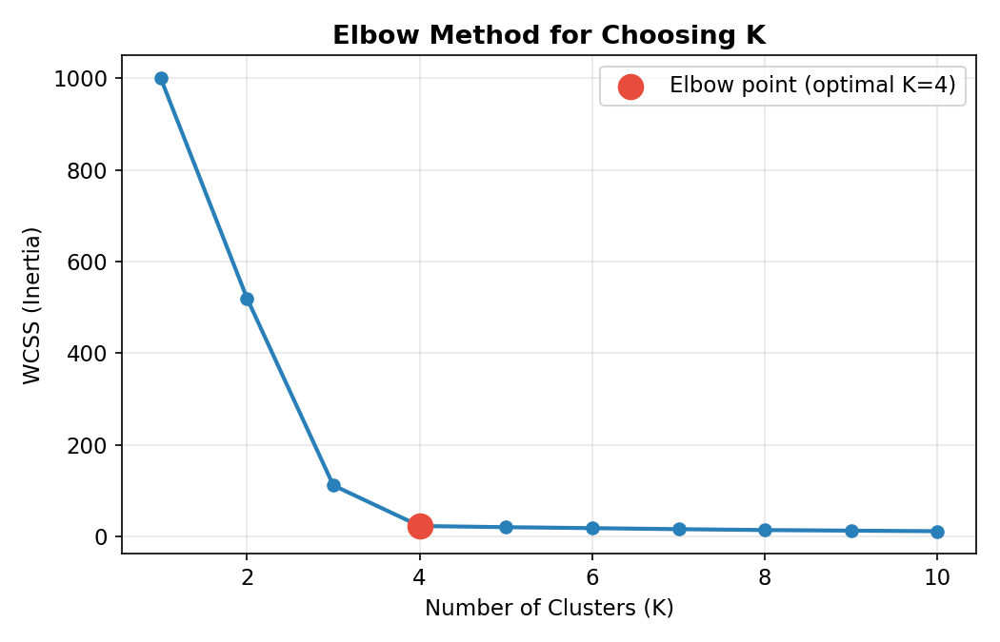
*WCSS (inertia) drops sharply at first, then flattens out — the "elbow" marks the optimal number of clusters.*

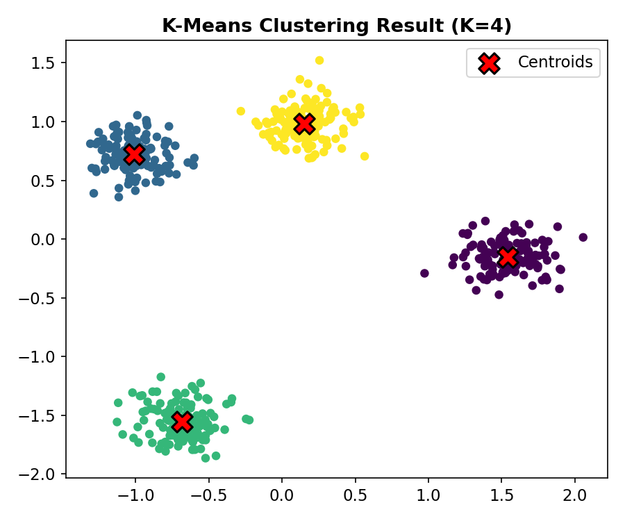
*K-Means applied to sample data with K=4 — points colored by assigned cluster, red X marks are the final centroids.*

---

## 15. DBSCAN

To handle K-Means' weaknesses (needing to predefine K, sensitivity to outliers, and inability to handle non-circular clusters), we use **DBSCAN — Density-Based Spatial Clustering of Applications with Noise**.

| | K-Means | DBSCAN |
|---|---|---|
| Approach | **Centroid-based** algorithm | **Density-based** algorithm |
| Needs K upfront? | Yes | No |
| Handles non-circular clusters? | No | Yes |
| Handles outliers well? | Less robust | More robust (naturally marks sparse points as noise) |

### Key Concepts
- DBSCAN is a **non-parametric algorithm** — it does not require you to specify the number of clusters in advance.
- It relies on **Epsilon Distance (ε)** — a radius that defines the neighborhood around each point.
- For a point to be part of a **dense region** (cluster), it needs a minimum number of neighboring points within its epsilon-distance circle.
- Points that don't have enough neighbors within `ε` are treated as **noise/outliers**, not forced into any cluster.
- This makes DBSCAN naturally good at finding clusters of **arbitrary shapes** (not just circular ones) and at ignoring outliers, unlike K-Means.

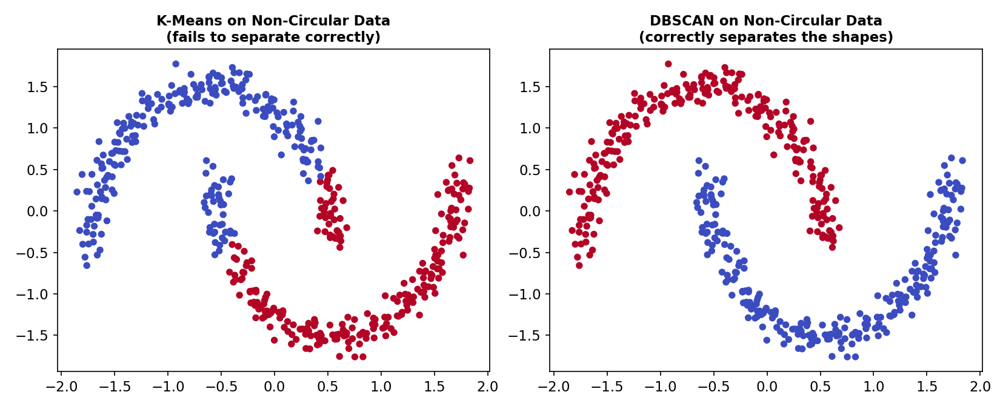
*On crescent-shaped clusters, K-Means (centroid-based) fails to separate them correctly, while DBSCAN (density-based) separates the two shapes cleanly.*

---

## 16. Curse of Dimensionality

As the number of features (dimensions) in a dataset grows very large, several problems emerge — collectively known as the **Curse of Dimensionality**:

- It becomes **very difficult to find meaningful patterns** in the data.
- Distance-based algorithms — **KNN, K-Means, DBSCAN** — all **fail in high dimensions**, because in very high-dimensional spaces, distances between points become less meaningful (points tend to appear roughly equidistant from each other).
- **Storage** requirements blow up as feature count grows.
- **Model training time** increases significantly with more features.

**Example from the notes:** Going from **150 features (150-Dimensional data)** down to **50 features (50-Dimensional data)** — while losing some information — makes the data far easier and faster to work with.

### How to Achieve Dimensionality Reduction
There are two main approaches:

1. **Feature Selection** — simply *choose* a subset of the existing original features to keep (drop the rest). No new features are created; you just select which of the original ones (e.g. `Z, X, Y`) to keep as the output.
2. **Feature Extraction** — *transform/combine* the existing features into a smaller set of brand-new features that still capture most of the important information (e.g. combining `x` and `y` into a new derived feature).

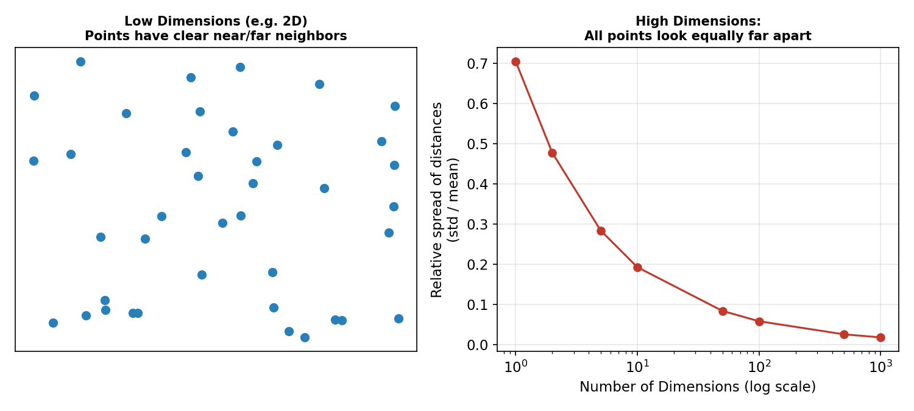
*As dimensions increase, the relative spread between distances shrinks toward zero — points start to look almost equally far from each other, which is why distance-based algorithms break down in high dimensions.*

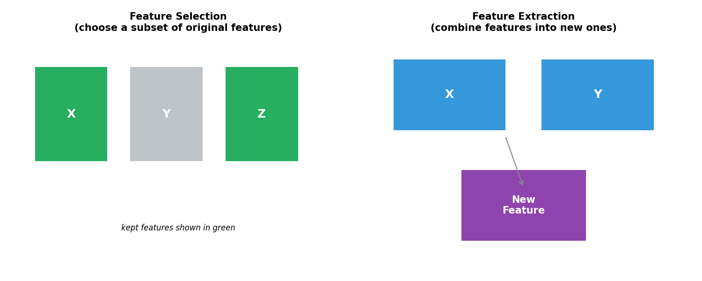
*Feature Selection keeps a subset of the original features as-is; Feature Extraction derives brand-new features that combine information from the originals.*

---

## 17. Dimensionality Reduction & PCA

Continuing the Feature Extraction idea: given features like `Engine Width` and `Engine Height`, instead of keeping both separately, we can **transform/extract** them into a single new combined feature — e.g. `Engine Size` — which still captures the essence of both original features, now used (along with `Price`) as a smaller 3D-style representation instead of the original higher-dimensional one.

> **Important:** dimensionality reduction always sacrifices *some* information — but the goal is to lose as little useful information as possible while still being able to make good predictions (e.g. still predicting `Price` well even after reducing dimensions).

### PCA (Principal Component Analysis)
**PCA** is the most widely used dimensionality-reduction technique for feature extraction. The core idea:

- Find a new axis/direction (called a **Principal Component**, e.g. **PC1**) along which the data's **variance is maximized** — i.e., the direction along which the spread/information of the data is best preserved.
- This is achieved mathematically through **Eigen Decomposition** of the data's covariance matrix — producing eigenvectors (the principal component directions) and eigenvalues (how much variance each direction captures).
- **PC1** captures the most variance, **PC2** (orthogonal to PC1) captures the next-most variance, and so on.
- By projecting the original high-dimensional data onto just the top few principal components (e.g. PC1 and PC2), we reduce the dimensionality while retaining most of the meaningful variance/information.

**Typical reductions:**
- 3D → 2D
- 500D → 100D (e.g. reducing 500 original features down to 100 principal components)

> **Key goal of PCA:** find the principal component line/axis where the **maximum variance is being captured** — that direction becomes your new, reduced feature space.

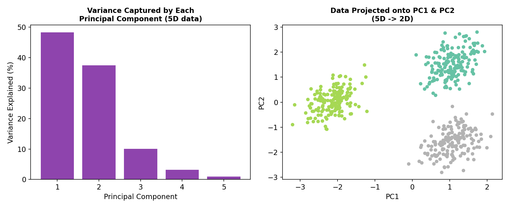
*Left: how much variance each principal component captures (PC1 + PC2 alone explain most of the 5-feature dataset's variance). Right: the same data projected down from 5 dimensions onto just PC1 and PC2 — the 3 original clusters are still clearly separable.*

---

## 18. Code Reference (from notebooks)

These snippets are taken from the accompanying notebooks and show how each concept from the notes is implemented in `scikit-learn` (and `xgboost`).

### Grid Search CV & Randomized Search CV (`GridSearchCV.ipynb`)
```python
import pandas as pd
import seaborn as sns
from sklearn.model_selection import train_test_split, GridSearchCV, RandomizedSearchCV
from sklearn.svm import SVC

df = sns.load_dataset('iris')
X = df.drop('species', axis=1)
y = df['species']

X_train, X_test, y_train, y_test = train_test_split(X, y, test_size=0.33, random_state=42)

model_svm = SVC(gamma='auto')

# Grid Search CV — tries every combination
classifier = GridSearchCV(model_svm, {
    'C': [1, 10, 20, 30],
    'kernel': ['rbf', 'linear'],
}, cv=5, return_train_score=False)
classifier.fit(X, y)

results = pd.DataFrame(classifier.cv_results_)
results[['param_C', 'param_kernel', 'mean_test_score']]

# Randomized Search CV — samples a fixed number of combinations
classifier_r = RandomizedSearchCV(model_svm, {
    'C': [1, 10, 20, 30],
    'kernel': ['rbf', 'linear'],
}, n_iter=4, cv=5, return_train_score=False)
classifier_r.fit(X, y)
```

### Ensemble Learning — Stacking, Random Forest, AdaBoost, Gradient Boosting, XGBoost (`EnsembleLearning.ipynb`)
```python
from sklearn.model_selection import train_test_split
from sklearn.ensemble import (StackingClassifier, RandomForestClassifier,
                               AdaBoostClassifier, GradientBoostingClassifier)
from sklearn.tree import DecisionTreeClassifier
from sklearn.linear_model import LogisticRegression
from sklearn.svm import SVC
from sklearn.metrics import accuracy_score
from sklearn.preprocessing import LabelEncoder
from xgboost import XGBClassifier
import seaborn as sns

df = sns.load_dataset('iris')
X = df.drop('species', axis=1)
y_encoded = LabelEncoder().fit_transform(df['species'])

X_train, X_test, y_train, y_test = train_test_split(
    X, y_encoded, test_size=0.2, random_state=42, stratify=y_encoded)

# --- Stacking ---
base_learners = [
    ('dt', DecisionTreeClassifier(random_state=42)),
    ('svc', SVC(probability=True, kernel='rbf', random_state=42)),
    ('lr', LogisticRegression(max_iter=1000))
]
stacking_clf = StackingClassifier(
    estimators=base_learners,
    final_estimator=LogisticRegression(max_iter=1000),
    cv=5
)
stacking_clf.fit(X_train, y_train)
accuracy_score(y_test, stacking_clf.predict(X_test))

# --- Bagging: Random Forest ---
rf_model = RandomForestClassifier(n_estimators=100, max_depth=None, random_state=42)
rf_model.fit(X_train, y_train)
accuracy_score(y_test, rf_model.predict(X_test))

# --- Boosting: AdaBoost ---
ada_model = AdaBoostClassifier(n_estimators=100, random_state=42)
ada_model.fit(X_train, y_train)
accuracy_score(y_test, ada_model.predict(X_test))

# --- Boosting: Gradient Boosting ---
gb_model = GradientBoostingClassifier(n_estimators=100, learning_rate=0.1, random_state=42)
gb_model.fit(X_train, y_train)
accuracy_score(y_test, gb_model.predict(X_test))

# --- Boosting: XGBoost ---
xgb_model = XGBClassifier(n_estimators=100, learning_rate=0.1, max_depth=3,
                           eval_metric='mlogloss', random_state=42)
xgb_model.fit(X_train, y_train)
accuracy_score(y_test, xgb_model.predict(X_test))
```

### Clustering — K-Means & DBSCAN (`Clustring.ipynb`)
```python
import pandas as pd
import matplotlib.pyplot as plt
import seaborn as sns
from sklearn.datasets import make_blobs, make_moons
from sklearn.cluster import KMeans, DBSCAN
from sklearn.preprocessing import StandardScaler

# --- K-Means + Elbow Method ---
X, _ = make_blobs(n_samples=500, centers=3, cluster_std=4, random_state=42)
df = pd.DataFrame(X, columns=['Feature_1', 'Feature_2'])
X_scaled = StandardScaler().fit_transform(df)

inertia = []
for k in range(1, 11):
    kmeans = KMeans(n_clusters=k, random_state=42)
    kmeans.fit(X_scaled)
    inertia.append(kmeans.inertia_)   # this is WCSS

plt.plot(range(1, 11), inertia, marker='o')   # elbow curve

kmeans_final = KMeans(n_clusters=3, random_state=42)
df['cluster'] = kmeans_final.fit_predict(X_scaled)
sns.scatterplot(x=df['Feature_1'], y=df['Feature_2'], hue=df['cluster'], palette='viridis')

# --- K-Means vs DBSCAN on non-circular data ---
X, _ = make_moons(n_samples=500, noise=0.05, random_state=42)
df = pd.DataFrame(X, columns=['Feature_1', 'Feature_2'])
X_scaled = StandardScaler().fit_transform(df)

kmeans_labels = KMeans(n_clusters=2, random_state=42).fit_predict(X_scaled)
dbscan_labels = DBSCAN(eps=0.3, min_samples=5).fit_predict(X_scaled)
# DBSCAN correctly separates the two moon-shaped clusters; K-Means struggles.
```

### PCA — Dimensionality Reduction (`PCADimensions.ipynb`)
```python
import pandas as pd
import seaborn as sns
from sklearn.datasets import make_blobs
from sklearn.preprocessing import StandardScaler
from sklearn.decomposition import PCA

X, y = make_blobs(n_samples=500, n_features=5, centers=3, cluster_std=1.5, random_state=42)
X_scaled = StandardScaler().fit_transform(X)

pca = PCA(n_components=2)          # reduce 5 features down to 2 principal components
X_pca = pca.fit_transform(X_scaled)

df_pca = pd.DataFrame(X_pca, columns=['PC1', 'PC2'])
df_pca['label'] = y
sns.scatterplot(data=df_pca, x='PC1', y='PC2', hue='label', palette='Set2')
```

---

## Quick-Reference Summary

| Concept | One-line takeaway |
|---|---|
| Model Tuning | Finding the best hyperparameters so the model generalizes to unseen data |
| Cross Validation | Split data into K folds, rotate the test fold, average the scores for a reliable performance estimate |
| Grid Search CV | Exhaustively tries every hyperparameter combination + CV — accurate but slow |
| Random Search CV | Randomly samples a fixed number of combinations — fast, scales to huge search spaces |
| Ensemble Learning | Combine multiple models' predictions (vote/average) for a stronger overall prediction |
| Stacking | Base models' predictions become input features for a meta-model |
| Bagging | Train the same model type on random bootstrap subsets in parallel; combine via voting/averaging — reduces variance |
| Random Forest | Bagging + Decision Trees, with random feature subsets per split |
| Boosting | Train models sequentially, each correcting the previous one's errors — reduces bias |
| AdaBoost / Gradient Boosting / XGBoost | Three flavors of boosting — reweighting errors / fitting residuals / optimized regularized gradient boosting |
| Unsupervised Learning | Learn structure from unlabeled data (no "right answer") |
| K-Means | Centroid-based clustering; needs K chosen upfront (Elbow Method); struggles with outliers & non-circular clusters |
| DBSCAN | Density-based clustering; no need to predefine K; handles noise and arbitrary cluster shapes |
| Curse of Dimensionality | Too many features → distance-based algorithms fail, storage/training cost explodes |
| PCA | Projects data onto principal components that capture maximum variance, reducing dimensions with minimal information loss |
