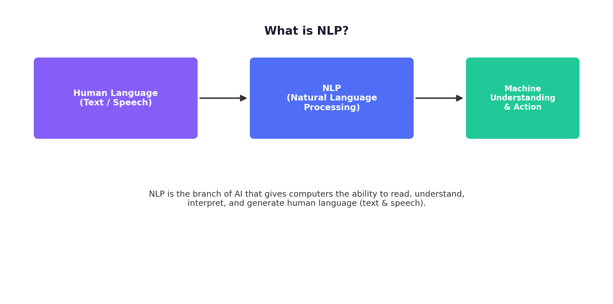
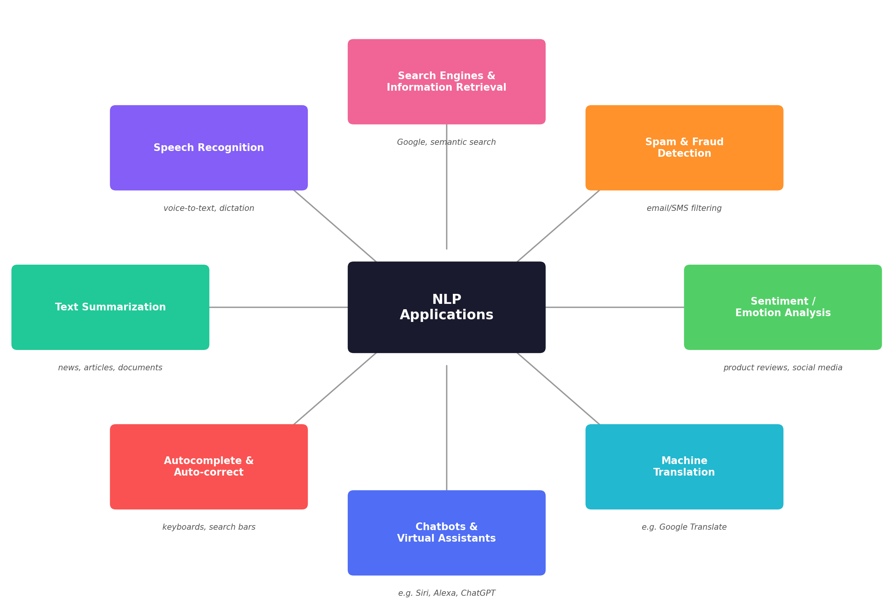
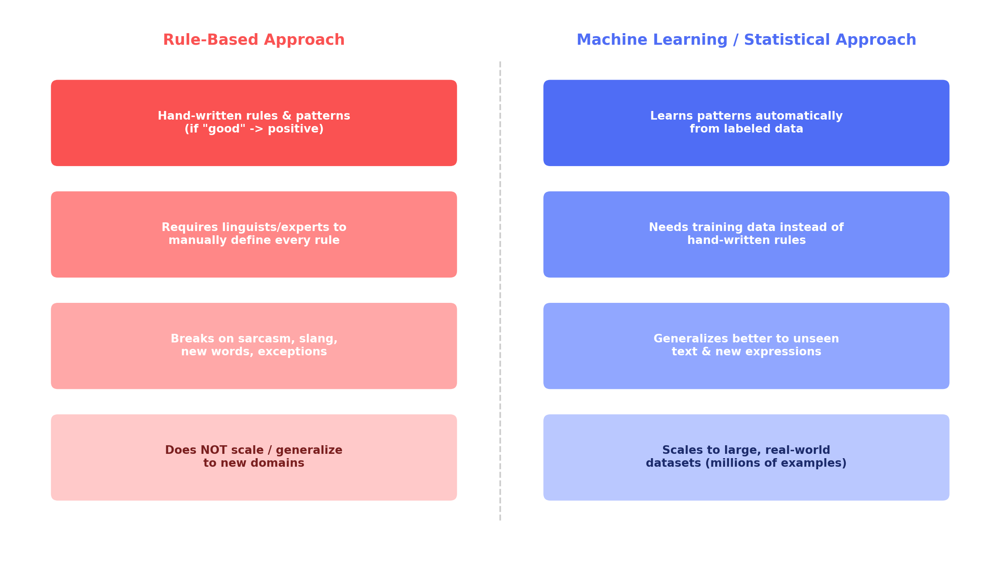
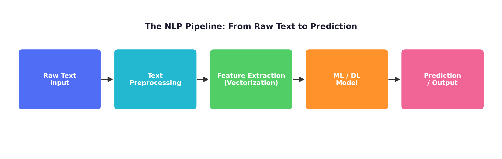
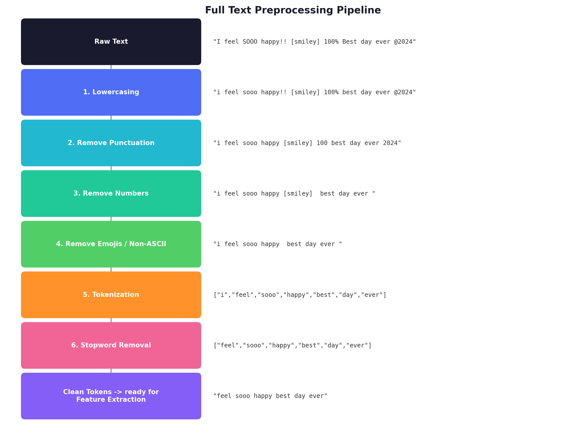
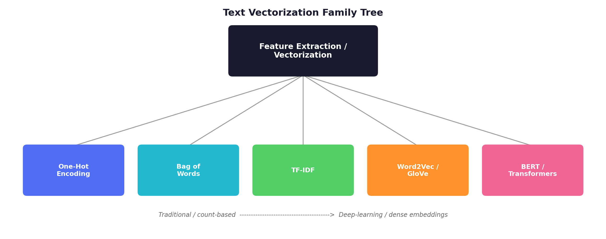
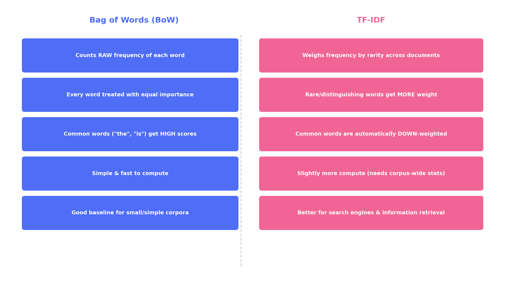
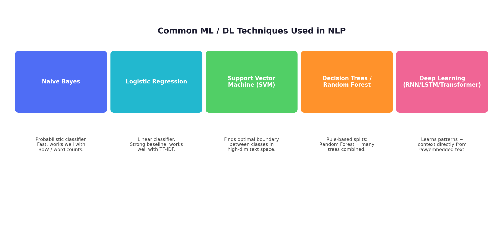
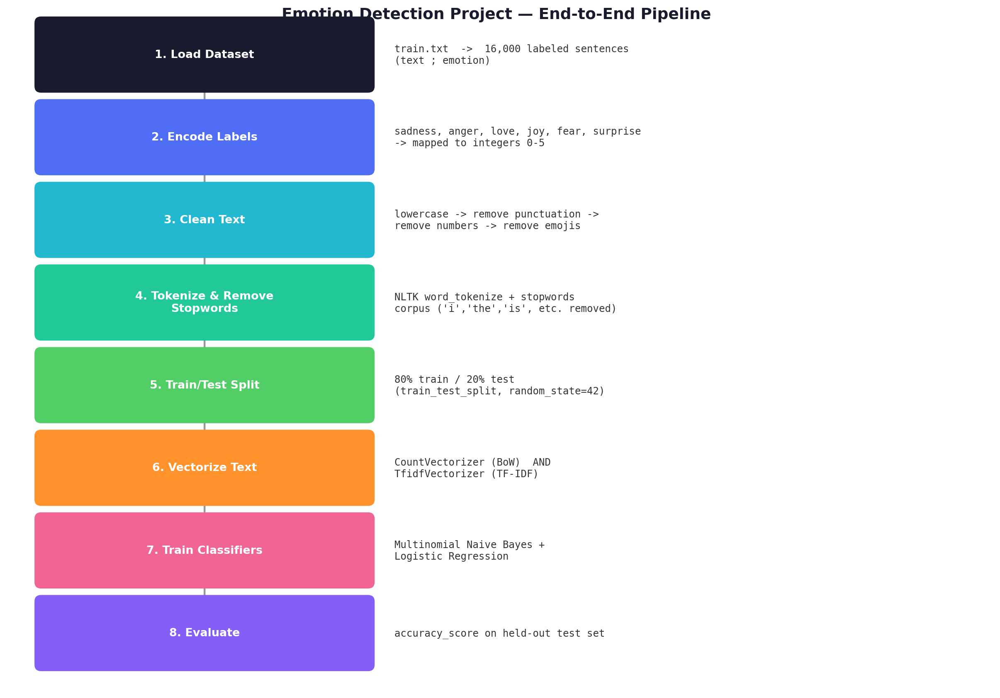
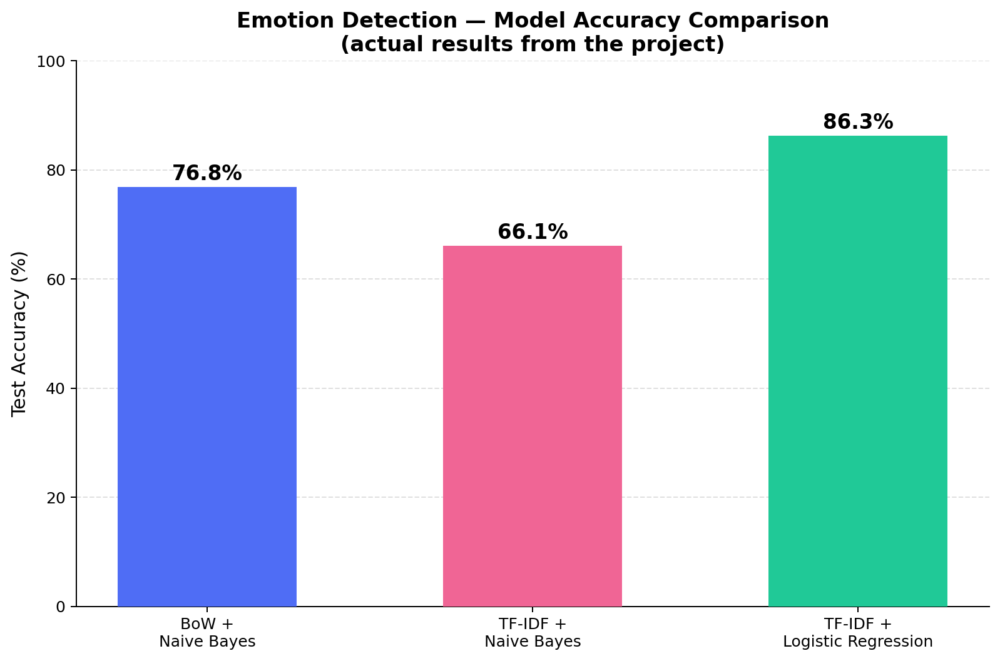

# 🧠 The Complete NLP Master Guide
### From Theory → Math → Code → a Real Emotion Detection Project

> A single, ultra-detailed, structured reference that merges **conceptual theory**, **hand-worked math examples**, and a **full hands-on Python project** — everything you need to understand how raw human text becomes a working machine learning model. Built from combined notes + a real end-to-end Emotion Detection project (Python, NLTK, Scikit-learn).

---

## 📑 Table of Contents

**Part I — Foundations**
1. [What is NLP and Why It Matters](#1-what-is-nlp-and-why-it-matters)
2. [Real-World Applications of NLP](#2-real-world-applications-of-nlp)
3. [Two Approaches to NLP: Rule-Based vs. Machine Learning](#3-two-approaches-to-nlp-rule-based-vs-machine-learning)
4. [The NLP Pipeline — Big Picture](#4-the-nlp-pipeline--big-picture)

**Part II — Text Preprocessing**
5. [Full Text Preprocessing Pipeline](#5-full-text-preprocessing-pipeline)

**Part III — Feature Extraction / Vectorization (Theory + Math)**
6. [Core NLP Terminology](#6-core-nlp-terminology)
7. [The Vectorization Family Tree](#7-the-vectorization-family-tree)
8. [One-Hot Encoding (OHE)](#8-one-hot-encoding-ohe)
9. [Bag of Words (BoW)](#9-bag-of-words-bow)
10. [N-grams (Bag of N-grams)](#10-n-grams-bag-of-n-grams)
11. [TF-IDF (Term Frequency – Inverse Document Frequency)](#11-tf-idf-term-frequency--inverse-document-frequency)
12. [Where Word2Vec / GloVe / BERT Fit In](#12-where-word2vec--glove--bert-fit-in)
13. [Master Comparison Table — All Vectorization Techniques](#13-master-comparison-table--all-vectorization-techniques)

**Part IV — Models**
14. [Common ML/DL Techniques Used in NLP](#14-common-mldl-techniques-used-in-nlp)

**Part V — Hands-On Project**
15. [Hands-On Project: Emotion Detection From Scratch](#15-hands-on-project-emotion-detection-from-scratch)
16. [Tools & Libraries Used](#16-tools--libraries-used)

**Part VI — Recap**
17. [Master Cheat Sheet](#17-master-cheat-sheet)

---

## 1. What is NLP and Why It Matters

**Natural Language Processing (NLP)** is the branch of Artificial Intelligence that gives computers the ability to **read, understand, interpret, and generate human language** — both text and speech.


*Human Language (Text/Speech) → NLP → Machine Understanding & Action*

### Why does NLP matter?

Human language is one of the richest, messiest forms of data that exists. Unlike numbers in a spreadsheet, language is:

| Property | What it means | Example |
|---|---|---|
| **Ambiguous** | The same word can mean different things | "bank" of a river vs. a "bank" that holds money |
| **Context-dependent** | Meaning changes based on surrounding words | "I'm sick" → illness, or "that's cool/awesome" |
| **Unstructured** | Doesn't come in neat rows/columns like a database | A paragraph vs. a spreadsheet cell |
| **Constantly evolving** | New slang appears daily | "lit," "sus," "no cap" |

Because so much of human knowledge and data (emails, reviews, social media, support tickets, legal documents, medical records) exists as free-flowing text, teaching a computer to understand it unlocks an enormous range of automation and intelligence. **NLP is the bridge between human communication and machine intelligence.**

---

## 2. Real-World Applications of NLP

NLP isn't academic — it already powers tools you use every day.



| Application | What it does | Real Examples |
|---|---|---|
| **Chatbots & Virtual Assistants** | Understand user queries and respond naturally | Siri, Alexa, Google Assistant, ChatGPT |
| **Machine Translation** | Convert text from one language to another | Google Translate, DeepL |
| **Sentiment / Emotion Analysis** | Detect the emotional tone behind text | Product reviews, social-media brand tracking — **exactly what our project does** |
| **Spam & Fraud Detection** | Classify messages as spam/legitimate | Gmail spam filter, SMS fraud detection |
| **Search Engines & Information Retrieval** | Rank documents by relevance to a query | Google Search (TF-IDF and descendants power much of this) |
| **Speech Recognition** | Convert spoken audio into text | Voice typing, dictation, call-center transcription |
| **Text Summarization** | Condense long documents into short summaries | News apps, document summarizers |
| **Autocomplete & Auto-correct** | Predict/fix the next word or spelling | Phone keyboards, search bars |

---

## 3. Two Approaches to NLP: Rule-Based vs. Machine Learning



### 🔴 Rule-Based Approach
A human expert writes explicit hand-written rules and patterns.

> Example rule: *"If the sentence contains the word 'good' or 'great', classify it as positive."*

**Limitations:**
1. **Doesn't scale** — near-infinite rules needed to cover every sentence structure, synonym, exception.
2. **Requires expert linguists** — heavy, ongoing manual effort.
3. **Breaks on sarcasm/slang** — *"yeah, that movie was 'good' alright"* (sarcasm) fools a keyword rule instantly.
4. **Brittle** — small wording variations a human understands instantly can break a rigid rule.

### 🔵 Machine Learning / Statistical Approach
Instead of hand-writing rules, we show the computer thousands (or millions) of **labeled examples** and let a statistical/ML algorithm **learn the patterns itself**.

> Example: Feed a model 10,000 movie reviews already labeled positive/negative → the model *learns* which words/combinations statistically correlate with each label.

**Why ML wins in practice:**
- ✅ **Generalizes** to patterns never explicitly seen.
- ✅ **Scales** to millions of examples without more hand-written rules.
- ✅ **Adapts** — retrain on new data → new slang/topics are picked up automatically.
- ✅ Powers essentially every modern production-grade NLP system (including the project in Part V).

> 💡 This guide focuses on the **ML/statistical approach**, since it's what modern NLP systems — and our project — actually use.

---

## 4. The NLP Pipeline — Big Picture

Every classical NLP/ML project follows the same shape, from raw input to final output:



| Stage | What happens | Covered in |
|---|---|---|
| 1️⃣ **Raw Text Input** | The messy, real-world sentence/document (tweet, review, ticket) | — |
| 2️⃣ **Text Preprocessing** | Cleaning text so a model can consume it | Section 5 |
| 3️⃣ **Feature Extraction / Vectorization** | Converting cleaned text into numbers | Sections 6–13 |
| 4️⃣ **ML/DL Model** | Classifier that learns from numeric features | Section 14 |
| 5️⃣ **Prediction / Output** | Final result — a label, translation, summary, etc. | Section 15 |

---

## 5. Full Text Preprocessing Pipeline

Raw text is messy — inconsistent capitalization, punctuation, numbers, emojis, and filler words that add noise, not meaning. **Preprocessing** cleans text before it's converted into numbers.



The stages below run **in order**, exactly as a typical pipeline (and our project) applies them:

### Step 1 — Lowercasing
Machines treat `"Happy"` and `"happy"` as two *completely different* tokens unless normalized.

```python
df['text'] = df['text'].apply(lambda x: x.lower())
```

### Step 2 — Punctuation Removal
Punctuation rarely carries the core meaning needed for classification, and it inflates the vocabulary (`"happy!"` ≠ `"happy"` otherwise).

```python
import string

def remove_punc(txt):
    return txt.translate(str.maketrans('', '', string.punctuation))

df['text'] = df['text'].apply(remove_punc)
```

### Step 3 — Number Removal
Digits are often noise for tasks like emotion/sentiment classification (though they *can* matter for tasks like extracting dates/prices — always consider your use case).

```python
def remove_numbers(txt):
    new = ""
    for i in txt:
        if not i.isdigit():
            new = new + i
    return new

df['text'] = df['text'].apply(remove_numbers)
```

### Step 4 — Emoji / Non-ASCII Removal
Emojis/special Unicode can't be understood by simple word-based models unless specifically handled.

```python
def remove_emojis(txt):
    new = ""
    for i in txt:
        if i.isascii():
            new += i
    return new

df['text'] = df['text'].apply(remove_emojis)
```

### Step 5 — Tokenization
Splitting a string into individual units (usually words). A prerequisite for stopword removal, BoW, TF-IDF, etc.

```python
import nltk
from nltk.tokenize import word_tokenize

nltk.download('punkt')
tokens = word_tokenize("i feel sooo happy today")
# ['i', 'feel', 'sooo', 'happy', 'today']
```

### Step 6 — Stopword Removal
**Stopwords** = extremely common words (*"i", "the", "is", "a", "and", "to"*...) that carry little discriminating signal for many ML tasks.

```python
import nltk
from nltk.corpus import stopwords

nltk.download('stopwords')
stop_words = set(stopwords.words('english'))

def remove_stopwords(txt):
    words = txt.split()
    cleaned = [w for w in words if w not in stop_words]
    return ' '.join(cleaned)

df['text'] = df['text'].apply(remove_stopwords)
```

### 🔍 Full Pipeline Trace — One Real Example

| Stage | Text |
|---|---|
| Raw | `"I feel SOOO happy!! [smiley] 100% Best day ever @2024"` |
| 1. Lowercase | `"i feel sooo happy!! [smiley] 100% best day ever @2024"` |
| 2. Remove punctuation | `"i feel sooo happy [smiley] 100 best day ever 2024"` |
| 3. Remove numbers | `"i feel sooo happy [smiley]  best day ever "` |
| 4. Remove emojis/non-ASCII | `"i feel sooo happy  best day ever "` |
| 5. Tokenize | `["i","feel","sooo","happy","best","day","ever"]` |
| 6. Remove stopwords | `["feel","sooo","happy","best","day","ever"]` |
| **Final** | `"feel sooo happy best day ever"` |

And from the real project dataset:

| Before | After |
|---|---|
| `"i can go from feeling so hopeless to so damned hopeful just from being around someone who cares and is awake"` | `"go feeling hopeless damned hopeful around someone cares awake"` |

Notice how filler words ("i," "can," "from," "so," "to," "just," "being," "who," "and," "is") were stripped, leaving only the emotionally meaningful words — exactly what we want before feature extraction.

---

## 6. Core NLP Terminology

Every vectorization technique below is defined in terms of these three words — learn them first.

| Term | Definition | Example |
|---|---|---|
| 📌 **Corpus** | The *entire collection* of text used in NLP — all the text your model reads and learns from | 100 movie reviews **together** = your corpus |
| 📌 **Document** | *One single* piece of text inside your dataset — a sentence, paragraph, or article | Each individual review = one document |
| 📌 **Vocabulary** | The list of all **unique** words present in your corpus — the "dictionary" used to convert words → numbers | `"I love pizza"` + `"I love pasta"` → vocabulary = `[I, love, pizza, pasta]` |

### The Running Example Used Throughout Part III

Nearly every technique below is demonstrated using this same 3-document toy corpus, so you can hand-trace exactly how each method builds its matrix:

| Doc | Sentence |
|---|---|
| D1 | Akarsh watch Sheryians |
| D2 | Harsh also watch Sheryians |
| D3 | Sheryians Teach Akarsh |

**Vocabulary** (6 unique words, in order of first appearance):
`[Akarsh, watch, Sheryians, Harsh, also, teach]`

---

## 7. The Vectorization Family Tree

Once text is clean, we still have **words**, not **numbers**. ML models are purely mathematical — **Feature Extraction (Vectorization)** converts cleaned text into numeric vectors a model can learn from.



| Category | Techniques | Approach |
|---|---|---|
| **Machine-Learning-based NLP** (traditional) | One-Hot Encoding, Bag of Words, N-grams, TF-IDF | **Count/frequency-based.** Text → sparse vector of counts/weights |
| **Deep-Learning-based NLP** (modern) | Word2Vec, GloVe, FastText, BERT/Transformers | **Embeddings.** Text → dense, learned vector capturing semantic meaning & context |

**Key distinction:** In classical count-based NLP, words like **"king"** and **"queen"** are treated as completely unrelated columns — even though they're semantically connected. Traditional techniques have no concept of *meaning*; they only count occurrences. Deep-learning embeddings solve this: the vector for "king" ends up mathematically *close* to "queen," and `king − man + woman ≈ queen` becomes computable.

| Technique | Idea | Used in our project? |
|---|---|---|
| One-Hot Encoding | Each word → a vector with a single 1, rest 0s | Foundational concept |
| Bag of Words (BoW) | Each document → vector of raw word counts | ✅ Used |
| TF-IDF | Each document → vector of *importance-weighted* scores | ✅ Used |
| Word2Vec / GloVe | Each word → dense vector capturing semantic meaning | Mentioned for context |
| BERT / Transformers | Each word → dense, *context-aware* vector | Mentioned for context |

---

## 8. One-Hot Encoding (OHE)

### Concept
The simplest way to turn words into numbers. For **every unique word** in the vocabulary, create a vector of length = vocabulary size, that is **all zeros except a single 1** at that word's position.

- Each **document** becomes a **matrix** (not a single vector!) — one row per word.
- Matrix shape = `(number of words in the document) × (size of vocabulary)`

### Worked Example
Vocabulary (6 words): `Akarsh | watch | Sheryians | Harsh | also | teach`

**D1 = "Akarsh watch Sheryians"** → shape `(3 × 6)`
```
Akarsh     → [1, 0, 0, 0, 0, 0]
watch      → [0, 1, 0, 0, 0, 0]
Sheryians  → [0, 0, 1, 0, 0, 0]
```

**D2 = "Harsh also watch Sheryians"** → shape `(4 × 6)`
```
Harsh      → [0, 0, 0, 1, 0, 0]
also       → [0, 0, 0, 0, 1, 0]
watch      → [0, 1, 0, 0, 0, 0]
Sheryians  → [0, 0, 1, 0, 0, 0]
```

Each row has exactly one `1` — hence "**one**-hot."

### Geometric Intuition
If you plot one-hot vectors of different words in space, every word vector is **equidistant** from every other, and all angles between them are **90° (mutually orthogonal)**. This shows OHE treats every word as **equally, maximally different** — there's no notion of two words being "closer in meaning."

### Pros & Cons

| ✅ Pros | ❌ Cons |
|---|---|
| Intuitive — very easy to understand | **Sparsity** — matrices are mostly zeros, wasting memory/computation |
| Easy to implement — no complex math | **OOV** — a new word at prediction time can't be represented |
| | **Size mismatch** — every document produces a *different*-shaped matrix (rows = doc length), doesn't fit fixed-size ML input |
| | **No semantic meaning** — every word is orthogonal (equally unrelated) to every other word |

---

## 9. Bag of Words (BoW)

### Concept
A technique that:
1. Builds a **vocabulary** of all unique words in the dataset.
2. For **each document**, counts **how many times each vocabulary word appears**.

BoW **ignores grammar and word order** — only frequency matters (hence "bag": like dumping all words into a bag and counting what's inside).

Unlike OHE, **BoW produces one single fixed-length vector per document** — a major practical advantage.

### Worked Example

| Doc | Sentence |
|---|---|
| D1 | Akarsh watch Sheryians |
| D2 | Harsh also watch Sheryians |
| D3 | Sheryians Teach **Sheryians** *(word repeated)* |

Vocabulary: `Akarsh | watch | Sheryians | Harsh | also | teach`

| Doc | Akarsh | watch | Sheryians | Harsh | also | teach |
|---|---|---|---|---|---|---|
| D1 | 1 | 1 | 1 | 0 | 0 | 0 |
| D2 | 0 | 1 | 1 | 1 | 1 | 0 |
| D3 | 0 | 0 | **2** | 0 | 0 | 1 |

D3's "Sheryians" column is **2** — the word appears **twice** in that document. (Unlike OHE, which can only ever record a `1`, BoW records the actual **count**.)

> **MF (Minimum Frequency)**: a threshold (e.g. `MF = 1`) so only words occurring at least MF times across the corpus enter the vocabulary — a common filter to shrink very large/noisy vocabularies.

> **New/unseen sentence idea:** given `D4 = "Sheryians is cool"`, a new document can be plotted/compared against existing document vectors using angle/distance in vector space — the basis of measuring **document similarity**.

### Bag of Words vs. TF-IDF — Side by Side



**The core problem with plain counting:** a word like *"feel"* might appear in almost every sentence of an emotions dataset — but BoW gives it the **same importance-by-count treatment** as any other word, even though it barely helps distinguish *which* emotion is present. This is exactly the weakness TF-IDF (Section 11) fixes.

### Pros & Cons

| ✅ Pros | ❌ Cons |
|---|---|
| Intuitive and simple | **Sparse matrix** — most entries are zero for large vocabularies |
| Easy to implement | **OOV** — unseen words can't be represented |
| **Fixed size** — every document → same-length vector, fixing OHE's size-mismatch problem | **Limited semantic meaning** — synonyms/related words are separate dimensions |
| Works well with classical ML (Naive Bayes, Logistic Regression, SVM) | **Ignores order** — different word arrangements (even opposite meanings via negation) can look identical |
| Fast and efficient to compute | |

```python
from sklearn.feature_extraction.text import CountVectorizer

bow_vectorizer = CountVectorizer()
X_train_bow = bow_vectorizer.fit_transform(X_train)
X_test_bow  = bow_vectorizer.transform(X_test)
```

---

## 10. N-grams (Bag of N-grams)

### Concept
An **N-gram** is a contiguous sequence of **N words**. Instead of single words as vocabulary units, N-grams group **N consecutive words together** as one "token" — same bag-of-counts idea as BoW, applied to multi-word chunks.

- **Unigram** = N = 1 (identical to standard BoW)
- **Bigram** = N = 2 (pairs of consecutive words)
- **Trigram** = N = 3 (triplets), and so on

### Worked Example 1 — Akarsh/Sheryians Corpus

| Doc | Sentence |
|---|---|
| D1 | Akarsh watch Sheryians |
| D2 | Harsh also watch Sheryians |
| D3 | Sheryians Teach Akarsh |

**Bigram vocabulary:** `Akarsh watch, watch Sheryians, Harsh also, Sheryians teach, Teach Akarsh`

| Doc | Akarsh watch | watch Sheryians | Harsh also | Sheryians teach | Teach Akarsh |
|---|---|---|---|---|---|
| D1 | 1 | 1 | 0 | 0 | 0 |
| D2 | 0 | 1 | 1 | 0 | 0 |
| D3 | 0 | 0 | 0 | 1 | 1 |

**Trigram vocabulary:** `Akarsh watch Sheryians`, `Harsh also watch`, `watch also Sheryians` — built by sliding a 3-word window across each document.

### Worked Example 2 — Why N-grams Matter for Meaning

| Doc | Sentence |
|---|---|
| D1 | Cricket is very good |
| D2 | Cricket is not good |

**Unigram vectors:**

| Doc | Cricket | is | very | good | not |
|---|---|---|---|---|---|
| D1 | 1 | 1 | 1 | 1 | 0 |
| D2 | 1 | 1 | 0 | 1 | 1 |

Comparing across **5 dimensions**: **3 match** (Cricket, is, good), only **2 differ** (very vs. not) — even though D1 means "cricket is good" and D2 means the **opposite**. Unigrams barely capture the meaning flip caused by "not."

**Bigram vectors:**

| Doc | Cricket is | is very | very good | is not | not good |
|---|---|---|---|---|---|
| D1 | 1 | 1 | 1 | 0 | 0 |
| D2 | 1 | 0 | 0 | 1 | 1 |

Now only **1 dimension is shared** ("Cricket is") — "is very / very good" (positive) vs. "is not / not good" (negative) become **entirely different tokens**. This is the key benefit: **bigrams (and higher N) preserve local word order/context**, so they distinguish meanings (like negation) that unigrams blur together.

### Pros & Cons

| ✅ Pros | ❌ Cons |
|---|---|
| **Semantic meaning** — captures a bit more context since word order within the N-word window is preserved (e.g. distinguishing "not good" from "very good") | **Dimensions explode** — N-gram vocabulary grows much faster than single-word vocabulary as N increases → longer, sparser vectors |
| | **OOV — worse than BoW** — an N-gram is only recognized if that *exact* sequence appeared during vocabulary building; even one new word invalidates every N-gram containing it |

---

## 11. TF-IDF (Term Frequency – Inverse Document Frequency)

### Concept
TF-IDF builds on OHE/BoW/N-grams by adding a crucial idea: **not all words are equally important**. A word appearing in *every* document (like "the," "is," or "Sheryians" in our toy corpus) carries little distinguishing information. A word appearing frequently in *one specific* document but rarely elsewhere is far more informative.

TF-IDF is a **weight**, not just a count:

$$\text{TF-IDF} = \text{TF} \times \text{IDF}$$

#### Term Frequency (TF)
How often a term appears **within one document**, normalized by that document's total word count:

$$\text{TF} = \frac{\text{count of word in this document}}{\text{total words in that document}}$$

#### Inverse Document Frequency (IDF)
How **rare or common** a term is **across the whole corpus**. Rarer terms → **higher** IDF; terms in every document → IDF of **zero**.

$$\text{IDF} = \log_e \left( \frac{\text{total documents in corpus}}{\text{documents containing the term}} \right)$$

- **TF** rewards words that appear often *within* a document.
- **IDF** *penalizes* words appearing in *many* documents, and *rewards* rarer, more distinguishing words.

### Worked Example — Step by Step

Corpus:

| Doc | Sentence |
|---|---|
| D1 | Akarsh watch Sheryians |
| D2 | Harsh also watch Sheryians |
| D3 | Sheryians Teach Akarsh |

Vocabulary: `Akarsh | watch | Sheryians | Harsh | also | teach`

**Step 1 — TF for D1 ("Akarsh watch Sheryians")**
D1 has 3 words total; "Akarsh," "watch," "Sheryians" each appear once:

$$\text{TF(Akarsh, D1)} = \text{TF(watch, D1)} = \text{TF(Sheryians, D1)} = \frac{1}{3}$$

For words **not present** in D1 (Harsh, also, teach): TF = **0**.

**Step 2 — IDF for each term (across all 3 documents)**

- "Akarsh" appears in **2** documents (D1, D3) of 3:
$$\text{IDF(Akarsh)} = \log_e\left(\frac{3}{2}\right) \approx 0.405$$
- "Sheryians" appears in **all 3** documents:
$$\text{IDF(Sheryians)} = \log_e\left(\frac{3}{3}\right) = \log_e(1) = 0$$

**Step 3 — Multiply TF × IDF for D1**

| Word | TF (D1) | IDF | TF-IDF (D1) |
|---|---|---|---|
| Akarsh | 1/3 | log(3/2) ≈ 0.405 | ≈ **0.135** |
| watch | 1/3 | (in D1 & D2 → log(3/2) ≈ 0.405) | ≈ **0.135** |
| Sheryians | 1/3 | log(3/3) = 0 | **0** |
| Harsh | 0 | — | 0 |
| also | 0 | — | 0 |
| teach | 0 | — | 0 |

> **Key takeaway:** "Sheryians" scores **exactly 0** in every document — even though it physically appears — *because* it's present in all 3 documents, so IDF correctly flags it as **uninformative for distinguishing documents** (like a stopword). "Akarsh," appearing in only 2 of 3, retains a meaningful weight. **This is the entire point of TF-IDF: down-weight common words, up-weight distinguishing words.**

```python
from sklearn.feature_extraction.text import TfidfVectorizer

tfidf_vectorizer = TfidfVectorizer()
X_train_tfidf = tfidf_vectorizer.fit_transform(X_train)
X_test_tfidf  = tfidf_vectorizer.transform(X_test)
```

### Pros & Cons

| ✅ Pros | ❌ Cons |
|---|---|
| **Information Retrieval** — TF-IDF's flagship use case; core building block of **search engines** (Google Search ranks relevance this way) | **Sparsity** — still a sparse, count-based representation (inherited from BoW) |
| | **OOV** — same fundamental limitation as OHE/BoW/N-grams |
| | **Dimensions** — vector length still tied to vocabulary size (grows further if combined with N-grams) |

### BoW vs. TF-IDF — Full Comparison

| | Bag of Words | TF-IDF |
|---|---|---|
| **What it measures** | Raw frequency | Frequency weighted by rarity across the corpus |
| **Common words (e.g. "feel")** | Treated as important (high count) | Automatically down-weighted |
| **Rare, distinguishing words** | Same weight as common words | Boosted — carry more signal |
| **Best suited for** | Simple baselines, small vocabularies | Search engines, document ranking, most real-world text classification |
| **Compute cost** | Simple & fast | Slightly more (needs corpus-wide stats) |

> ⚠️ **Real-world nuance (proven by our project's actual results in Section 15):** switching from BoW to TF-IDF *while keeping the same model* (Naive Bayes) actually **hurt** accuracy. The vectorizer and the model need to be a good match — TF-IDF's continuous weighted values don't align as naturally with Naive Bayes' probabilistic count-based assumptions as raw counts do. TF-IDF paired with **Logistic Regression**, however, gave the *best* result of all three combinations tested. **Vectorization choice and model choice are not independent decisions.**

---

## 12. Where Word2Vec / GloVe / BERT Fit In

Word2Vec and BERT/Transformers sit at the far end of the vectorization spectrum, marking the transition from **ML-based, count-driven vectorization** (OHE → BoW → N-grams → TF-IDF) to **Deep-Learning-based, learned embeddings**:

- **Word2Vec, GloVe, FastText** — convert each word into a **dense vector** (far shorter than one-hot/BoW, no zeros) learned by training a neural network on huge amounts of text. These capture **semantic relationships**: words used in similar contexts end up with similar (nearby) vectors — solving the "king/queen unrelated" weakness of count-based methods.
- **BERT / Transformers** — go further, producing **contextual embeddings**, where the *same* word gets a *different* vector depending on the surrounding sentence (e.g., "bank" of a river vs. "bank" the financial institution).

---

## 13. Master Comparison Table — All Vectorization Techniques


| Technique | Output per Document | Word Order? | Semantic Meaning? | Fixed-Size Vector? | Main Weakness |
|---|---|---|---|---|---|
| **One-Hot Encoding** | Matrix (`words × vocab size`) | ❌ No | ❌ No | ❌ No (varies by doc length) | Sparsity, OOV, size mismatch, no meaning |
| **Bag of Words** | Vector (`1 × vocab size`) | ❌ No | ⚠️ Very limited | ✅ Yes | Sparsity, OOV, ignores order/meaning |
| **N-grams** | Vector (`1 × n-gram vocab size`) | ✅ Partial (N-word window) | ⚠️ A little better | ✅ Yes | Dimensions explode, OOV even worse |
| **TF-IDF** | Weighted vector (`1 × vocab size`) | ❌ No | ⚠️ Limited (weights importance, not meaning) | ✅ Yes | Sparsity, OOV, dimensions |
| **Word2Vec / GloVe / FastText** | Dense embedding vector | ⚠️ Context-window based | ✅ Yes | ✅ Yes | Needs large training data/compute |
| **BERT / Transformers** | Dense **contextual** embedding | ✅ Full sentence context | ✅✅ Best | ✅ Yes | Computationally expensive |

**Progression logic:** each technique fixes the previous one's biggest weakness:

```
OHE (no fixed size) → BoW (fixed size, no order) → N-grams (adds local order, explodes dimensions)
   → TF-IDF (adds importance-weighting, still no true meaning) → Word2Vec/BERT (real semantic meaning via dense embeddings)
```

---

## 14. Common ML/DL Techniques Used in NLP

Once text is vectorized, any standard ML classification/regression algorithm applies.



| Model | How it works | Why it's popular for text |
|---|---|---|
| **Naive Bayes** | Applies Bayes' theorem, assumes word features are independent given the class | Extremely fast, works surprisingly well with word-count data (BoW); classic first baseline |
| **Logistic Regression** | Learns a linear decision boundary via sigmoid/softmax | Strong, reliable baseline; handles high-dimensional sparse text vectors (like TF-IDF) very well |
| **Support Vector Machine (SVM)** | Finds the optimal separating hyperplane between classes | Performs well in high-dimensional spaces; common in spam detection & text classification |
| **Decision Trees / Random Forest** | Rule-like if/else splits; Random Forest = many trees combined | Interpretable, but less often the top choice for pure text |
| **Deep Learning (RNN/LSTM/Transformers)** | Neural networks that learn patterns/context directly from (embedded) text sequences | State-of-the-art performance, but needs much more data/compute |

Our hands-on project uses **Multinomial Naive Bayes** and **Logistic Regression** — both directly compatible with `CountVectorizer`/`TfidfVectorizer` output.

---

## 15. Hands-On Project: Emotion Detection From Scratch

Classifying text into one of **six emotions** — a widely used NLP benchmark task.



### 15.1 — The Dataset

`train.txt` — **16,000 labeled sentences**, each line = a sentence + emotion, separated by `;`:

```
i didnt feel humiliated;sadness
i can go from feeling so hopeless to so damned hopeful...;sadness
im grabbing a minute to post i feel greedy wrong;anger
i am ever feeling nostalgic about the fireplace...;love
```

Loaded with Pandas:

```python
import pandas as pd

df = pd.read_csv('train.txt', sep=';', header=None, names=['text', 'emotion'])
df.head()
```

Six emotion categories total — **sadness, anger, love, joy, fear, surprise** — with **zero missing values** (`df.isnull().sum()` confirms this in both columns).

### 15.2 — Encoding the Labels

ML models need numeric labels, so each unique emotion string is mapped to an integer:

```python
unique_emotions = df['emotion'].unique()
emotion_numbers = {}
i = 0
for emo in unique_emotions:
    emotion_numbers[emo] = i
    i += 1

df['emotion'] = df['emotion'].map(emotion_numbers)
```

Produces a dictionary like `{'sadness': 0, 'anger': 1, 'love': 2, ...}` (order = first appearance), and replaces the text label column with its integer.

### 15.3 — Cleaning the Text

The exact preprocessing pipeline from Section 5, in sequence: lowercase → punctuation removal → number removal → emoji/non-ASCII removal → tokenize (NLTK) → stopword removal (NLTK English stopword list).

| Before | After |
|---|---|
| `"i can go from feeling so hopeless to so damned hopeful just from being around someone who cares and is awake"` | `"go feeling hopeless damned hopeful around someone cares awake"` |

### 15.4 — Splitting the Data

```python
from sklearn.model_selection import train_test_split

X_train, X_test, y_train, y_test = train_test_split(
    df['text'], df['emotion'], test_size=0.20, random_state=42
)
```

**80% train / 20% test** split (~12,800 train / ~3,200 test), `random_state=42` for reproducibility.

### 15.5 — Vectorizing With Bag of Words + Naive Bayes

```python
from sklearn.feature_extraction.text import CountVectorizer
from sklearn.naive_bayes import MultinomialNB
from sklearn.metrics import accuracy_score

bow_vectorizer = CountVectorizer()
X_train_bow = bow_vectorizer.fit_transform(X_train)
X_test_bow = bow_vectorizer.transform(X_test)

nb_model = MultinomialNB()
nb_model.fit(X_train_bow, y_train)

pred_bow = nb_model.predict(X_test_bow)
print(accuracy_score(y_test, pred_bow))
```

**Result: `0.768` → 76.8% accuracy.**

> 🔑 **Critical detail:** `fit_transform` is called on the **training** data (learns the vocabulary AND transforms text); only `.transform()` (no `fit`) is called on the **test** data. This ensures the test set is vectorized using *only* the vocabulary learned from training — never leaking test-set information into the model, which would give a falsely optimistic accuracy.

### 15.6 — Vectorizing With TF-IDF + Naive Bayes

```python
from sklearn.feature_extraction.text import TfidfVectorizer

tfidf_vectorizer = TfidfVectorizer()
X_train_tfidf = tfidf_vectorizer.fit_transform(X_train)
X_test_tfidf = tfidf_vectorizer.transform(X_test)

nb2_model = MultinomialNB()
nb2_model.fit(X_train_tfidf, y_train)

y_pred = nb2_model.predict(X_test_tfidf)
print(accuracy_score(y_test, y_pred))
```

**Result: `0.661` → 66.1% accuracy** — noticeably *lower* than plain BoW with the same model!

### 15.7 — Vectorizing With TF-IDF + Logistic Regression

```python
from sklearn.linear_model import LogisticRegression

logistic_model = LogisticRegression(max_iter=1000)
logistic_model.fit(X_train_tfidf, y_train)

log_pred = logistic_model.predict(X_test_tfidf)
print(accuracy_score(y_test, log_pred))
```

**Result: `0.863` → 86.3% accuracy** — the best of all three combinations!

### 15.8 — Comparing the Results



| Vectorizer | Model | Accuracy |
|---|---|---|
| Bag of Words | Multinomial Naive Bayes | **76.8%** |
| TF-IDF | Multinomial Naive Bayes | 66.1% |
| TF-IDF | Logistic Regression | **86.3% ✅ Best** |

**Key lessons from these real results:**

1. **The vectorizer + model pairing matters as much as either choice alone.** TF-IDF made Naive Bayes *worse* here, while it made Logistic Regression noticeably *better*. Naive Bayes' math assumes count-like/frequency data, so raw BoW counts fit it more naturally than TF-IDF's continuous weighted scores.
2. **Logistic Regression + TF-IDF was the clear winner** — a very common, reliable combination in real-world text classification.
3. **Always try more than one vectorizer/model combination.** There's no universal "best" — the right pairing is found empirically, exactly as demonstrated here.

---

## 16. Tools & Libraries Used

| Tool | Purpose |
|---|---|
| **Python** | Core programming language for the entire project |
| **Pandas** | Loading, exploring, manipulating the tabular text dataset |
| **NLTK** (Natural Language Toolkit) | Tokenization (`word_tokenize`) and stopword removal (`stopwords` corpus) |
| **Scikit-learn (`sklearn`)** | `CountVectorizer`, `TfidfVectorizer` for feature extraction; `MultinomialNB`, `LogisticRegression` for classification; `train_test_split`, `accuracy_score` for evaluation |
| **Matplotlib / Seaborn** | Data visualization / EDA |

---

## 17. Master Cheat Sheet

### 🧩 Big Picture
- **NLP** = teaching machines to understand human language; powers chatbots, translation, sentiment analysis, search engines, and more.
- **Rule-based systems** don't scale and break on new/unusual language; **ML/statistical approaches** learn patterns from data and generalize far better — why virtually all modern NLP is ML-based.
- Every classical NLP pipeline: **Raw Text → Preprocessing → Vectorization → Model → Prediction.**

### 🧹 Preprocessing
`lowercase → remove punctuation → remove numbers → remove emojis/non-ASCII → tokenize → remove stopwords`
This strips noise so the model can focus on meaningful words.

### 🔢 Terminology
- **Corpus** = all your text. **Document** = one unit of text. **Vocabulary** = all unique words.

### 📊 Vectorization Quick Recall
- **One-Hot Encoding** → one document = one matrix, each word = a 1-in-a-sea-of-0s vector. Simple but sparse, no fixed size, no meaning.
- **Bag of Words** → one document = one vector of **word counts**. Fixed size, but ignores order/meaning.
- **N-grams** → group N consecutive words as one token before counting. Adds a bit of order/meaning back, but blows up dimensionality.
- **TF-IDF** → weight = TF (how common in *this* doc) × IDF (how rare across *all* docs). Down-weights common/stopword-like terms; up-weights distinguishing words. Powers search engines.
- **Word2Vec/BERT** → move past counting entirely; learn dense vectors where meaning and context are baked in.

### 🤖 Models
- **Naive Bayes** and **Logistic Regression** are the classic go-to models for text classification once vectorized — always worth testing both.
- **SVM** performs well in high-dimensional text space; **Decision Trees/Random Forest** are interpretable but less common for pure text; **Deep Learning (RNN/LSTM/Transformers)** is state-of-the-art but data/compute hungry.

### 🏆 Real Project Result
**TF-IDF + Logistic Regression (86.3%)** beat both **BoW + Naive Bayes (76.8%)** and **TF-IDF + Naive Bayes (66.1%)** — proof that the *combination* of vectorizer and model is a design decision in itself, not an afterthought.

---

*End of guide. Built as a single reference combining full NLP theory (terminology → OHE → BoW → N-grams → TF-IDF → embeddings), the underlying math with worked examples, and a complete, reproducible Emotion Detection ML project.*
